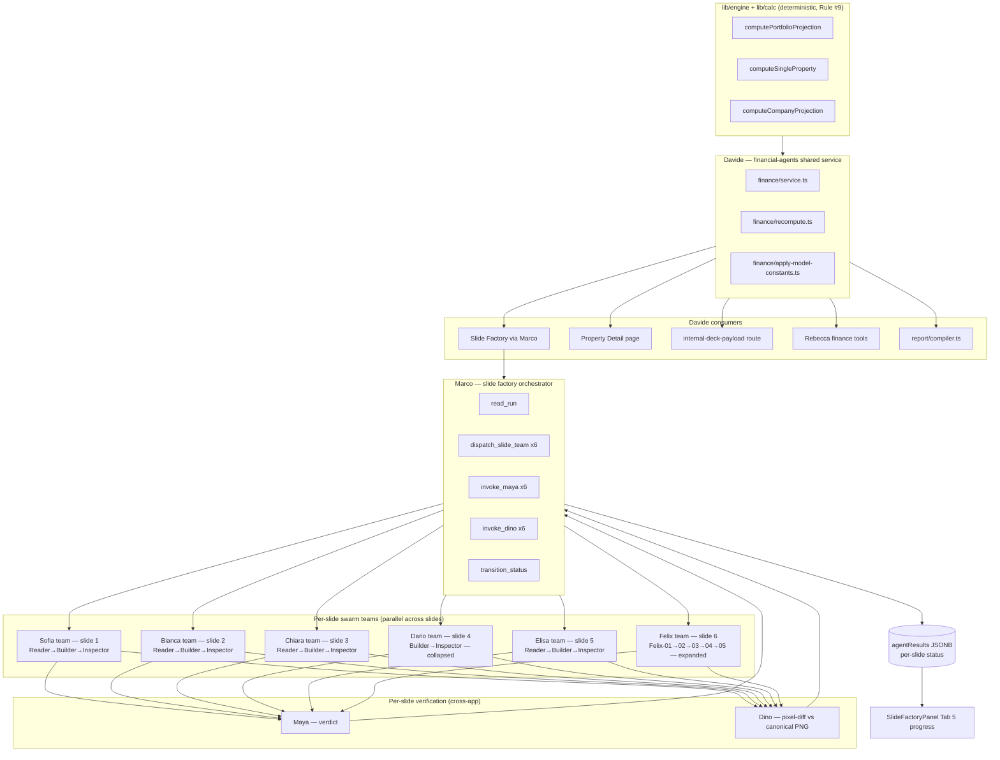

# Slide Factory Completion — Marco, Tabs 5/6, per-slide swarms, financial-agents naming

## Summary

Finish the slide factory pipeline: build Marco (orchestrator, currently absent), wire Tabs 5 (build) and 6 (download) in `SlideFactoryPanel`, implement the six per-slide swarm teams (Sofia / Bianca / Chiara / Dario / Elisa / Felix) per the Reader→Builder→Inspector triad with documented exceptions, add Maya (verdict) and Dino (pixel-diff) verification agents, close the slide-factory parity gap by populating the parity map and adding Rebecca tools for every slide-factory endpoint, and retroactively name `finance/service.ts` + `finance/recompute.ts` as the **shared financial-agents service** consumed by the slide factory and other surfaces (property detail, internal-deck, Rebecca tools, report compiler).

---

## Problem Frame

The slide factory pipeline shipped Tabs 1–4 between 2026-05-04 and 2026-05-07: brief upload, Lorenzo ingestion (with Aldo / Carlo / Lorenzo-05 inspector), property assignment, and Lucca draft review. The remaining surface is the build-and-deliver half of the pipeline — currently a placeholder.

What's missing on the slide factory surface:

- **Marco does not exist.** `routes/slide-factory.ts:432` carries the comment *"Marco dispatch (slide teams) will be added in a later build unit."* The `building` status is a write-only terminus today; nothing reads it. Without Marco there is no path from `draft_review` → `building` → `complete`.
- **Tabs 5 (build) and 6 (download) are placeholders** in `SlideFactoryPanel.tsx:1348–1360`. The schema has `agentResults` JSONB shaped for per-slide `pixelDiffPct` / `mayaVerdict` / `mayaNotes`, but the agents that populate it (Maya, Dino, the per-slide swarms) are unbuilt.
- **Per-slide swarms are unbuilt.** The Agent-Native Precision Pipeline doc names Sofia / Bianca / Chiara / Dario / Elisa / Felix per slide, with a Reader→Builder→Inspector default triad (Dario collapses to 2, Felix expands to 5 for USALI complexity). None exist on disk.

What's missing on the agent-native surface:

- **Rebecca has zero slide-factory tools.** The four LB-deck tools in `rebecca-tools.ts:147–176` target the *legacy* `lb-deck-pdf` route, not the slide factory. The parity map at `docs/discipline/agent-native-parity-map.md` has no "Slide Factory Pipeline" section. Per CLAUDE.md §7 this is a hard gap that must be resolved alongside any slide-factory UI work.
- **The "financial agents" service layer the user described as serving the slide factory and many other parts of the app does not exist as a named layer.** The de-facto pieces — `finance/service.ts` (three pure compute entrypoints) and `finance/recompute.ts` (three DB-stamping wrappers) — already do that job, but no consumer treats them as a discrete shared service, so each consumer redoes the recompute→derive→shape dance inline.

This plan finishes the slide factory surface, closes the parity gap, and names the financial-agents service. It does not refactor existing Lorenzo / Lucca code (that is a separate plan, deferred below).

---

## Requirements

- **R1.** Marco orchestrator built and wired to the `building` status transition in `slide_factory_runs`. Owns per-slide swarm dispatch, Maya verdict invocation, Dino pixel-diff invocation, and `complete` transition.
- **R2.** Six per-slide swarm teams implemented (Sofia / Bianca / Chiara / Dario / Elisa / Felix) per the Reader→Builder→Inspector triad with documented exceptions: Dario collapses to 2, Felix expands to 5.
- **R3.** Maya (verdict) and Dino (pixel-diff) cross-app verification agents built, populating `SlideAgentResult` (`pixelDiffPct`, `mayaVerdict`, `mayaNotes`) per slide.
- **R4.** SlideFactoryPanel Tab 5 progress UI shows live per-slide swarm + Maya + Dino status; Tab 6 shows download surface with cached deck.
- **R5.** Slide-factory parity map populated under `docs/discipline/agent-native-parity-map.md` with one row per endpoint in `artifacts/api-server/src/routes/slide-factory.ts`. Every UI action ↔ Rebecca tool.
- **R6.** Rebecca tools added in `artifacts/api-server/src/chat/rebecca-tools.ts` for every slide-factory endpoint, emitting `dataChanged` on SSE `done` so the frontend invalidates queries (per Rebecca agent-native pattern).
- **R7.** `finance/service.ts` + `finance/recompute.ts` retroactively named as the **Davide** financial-agents shared service, with a contract surface documented in `docs/discipline/financial-agents-contract.md`. Existing consumers (slide factory, property detail page, internal-deck-payload, Rebecca tools, report compiler) cited as the >2 independent consumers per the Fork-A escape hatch.
- **R8.** Lorenzo's 5-step chain (Aldo → PNG keys → Vision → Carlo → Lorenzo-05) preserved exactly per `docs/solutions/architecture-patterns/lorenzo-vision-pipeline-canonical-ingestion-2026-05-07.md`. No re-shaping in this plan.
- **R9.** Verification gates pass on every unit: `pnpm run typecheck`, `scripts/node_modules/.bin/tsx scripts/src/check-magic-numbers.ts`, slide-factory test suite. Units that touch DB schema also run `pnpm --filter @workspace/scripts run check:migration-guards`.
- **R10.** Naming convention applied per CLAUDE.md §10: per-slide swarm members use `Name-NN` (e.g., `Sofia-01` / `Sofia-02` / `Sofia-03` for the slide-1 triad), cross-app agents (Marco, Maya, Dino, Davide) single-name. Identity strings in code use the `Name-NN` form; filenames remain function-suffixed per existing convention.

---

## Scope Boundaries

- **ADR-010 roadmap items** — LP-net IRR, European waterfall, Specialist Q (Quitéria), Specialist R (Rafaela), per-property SPV modeling. Out per master priority plan.
- **Master priority plan Lane 2/4/5 items** that are not direct slide-factory blockers — seed refi rates (L2-U5), company overhead (L2-U6), reseed (L2-U7), NAI-23 CTE (L4-U10), property income tax → getFactoryNumber (L5-U11), transfer tax → market_rates (L5-U12). These continue in their own queue.
- **R2 logos / Logo Album** — Replit Agent's lane.
- **`admin/tools.ts:121` broken `.claude/claude.md` path** — separate small bug.
- **CLAUDE.md §10 filename-vs-banner naming clarification** — separate small docs PR.
- **Brand folder schema clarification** beyond what shipped in `dce84d4e`.
- **Push to origin / Railway deploy** — gated by user's project-task workflow.

### Deferred to Follow-Up Work

- **Refactor Lorenzo (`lorenzo-vision.ts` / `lorenzo-ingestion.ts` / `lorenzo-inspector.ts`) and Lucca (`lucca-draft.ts`) from workflow-encoded TS to prompt-native** per ce-agent-native-architecture skill #13. Lorenzo's 5-step chain is mandated as fixed by `lorenzo-vision-pipeline-canonical-ingestion-2026-05-07.md`; refactoring would be behavioral change and demands its own plan. Lucca's 738-line workflow function (four sequential drafter calls in TS) is the heaviest workflow-encoded module; refactor warrants its own plan.
- **Option (b) financial-agents reshape** — absorb packaging logic from `slides/build-payload.ts`, `slides/build-lb-payload.ts`, and `report/compiler.ts` into shared agents. This plan does option (a) only (rename existing surface). Option (b) becomes a separate plan once Tab 5/6 land and the consumer list is fully visible.
- **Live Maya verdict caching (Enzo)** — deferred per `lorenzo-vision-pipeline-canonical-ingestion-2026-05-07.md`.
- **Architectural learning compound** — once Phase 3 ships, capture a `docs/solutions/architecture-patterns/financial-agents-shared-service-naming-2026-MM-DD.md` learning so the rename pattern is reusable.

---

## Context & Research

### Relevant Code and Patterns

**Slide factory current state:**
- `artifacts/api-server/src/slides/lorenzo-ingestion.ts:39` — `runLorenzoIngestion(runId)` orchestrates the fixed 5-step chain. Marco will sit downstream of this.
- `artifacts/api-server/src/slides/lorenzo-vision.ts:264` — `runLorenzoVision(aldoResult)` per-slide loop with Opus 4.7.
- `artifacts/api-server/src/slides/lorenzo-inspector.ts:53` — `runLorenzoInspector(blocksBySlide)` Hybrid Inspector Pass 2 (LLM-vision).
- `artifacts/api-server/src/slides/lucca-draft.ts:656` — `runLuccaDraft(runId)` four sequential drafter calls. Tab 4 reads its output.
- `artifacts/api-server/src/slides/minions/aldo.ts:51`, `minions/carlo.ts:58` — deterministic minions; primitive-shaped, use as template.
- `artifacts/api-server/src/storage/slide-factory-runs.ts` — full CRUD on `slide_factory_runs`.
- `artifacts/api-server/src/routes/slide-factory.ts:13–22, 432` — every endpoint plus the Marco-dispatch TODO marker.
- `artifacts/hospitality-business-portal/src/features/slide-factory/SlideFactoryPanel.tsx:1348–1360` — Tab 5/6 placeholder JSX.

**Schema and contracts:**
- `lib/db/src/schema/slide-factory-runs.ts:8–18, 38–48, 60` — 9-status enum docstring + `SlideAgentResult` shape with `pixelDiffPct` / `mayaVerdict` / `mayaNotes`. The schema embeds the future plan; we follow it.

**Financial-agents de-facto surface (target of Davide rename in U3):**
- `artifacts/api-server/src/finance/service.ts:130, 209, 265` — three pure compute entrypoints (`computePortfolioProjection`, `computeSingleProperty`, `computeCompanyProjection`). ADR-007-clean.
- `artifacts/api-server/src/finance/recompute.ts:36` — three DB-stamping wrappers; the docstring already calls this *"the one server-side seam where engine output meets the DB."*
- `artifacts/api-server/src/finance/apply-model-constants.ts` — `withModelConstants(...)` injects DB constants into engine input.
- `artifacts/api-server/src/slides/build-payload.ts`, `build-lb-payload.ts`, `report/compiler.ts` — current consumers (will stay as consumers under option (a)).

**Rebecca / parity:**
- `artifacts/api-server/src/chat/rebecca-tools.ts:147–176` — four legacy LB-deck tools to keep separate from new factory tools.
- `docs/discipline/agent-native-parity-map.md:37–45` — "Slides / Deck Actions" section to extend with a new "Slide Factory Pipeline" subsection.

### Institutional Learnings

Mandatory patterns this plan honors verbatim:

- `docs/solutions/architecture-patterns/lorenzo-vision-pipeline-canonical-ingestion-2026-05-07.md` — Lorenzo 5-step chain fixed. Carlo schema gate + Lorenzo-05 semantic gate both required. Constants in `deck-render-constants.ts`. `new RegExp("...")` for `{N}` quantifiers (magic-number ratchet workaround). Caching deferred.
- `docs/solutions/architecture-patterns/slide-factory-runs-schema-design-2026-05-07.md` — 9-value status enum is the single source of truth (no `currentTab` shadow). Property assignments are FK columns. DB-level CHECK constraint on status.
- `docs/solutions/architecture-patterns/agent-native-precision-pipeline-pattern-2026-05-06.md` — Reader→Builder→Inspector triad with Dario-collapse-to-2 and Felix-expand-to-5 exceptions. Hybrid Inspector = deterministic Pass 1 + LLM-vision Pass 2 (both blocking). Drafter outputs never reach Builder unmediated. 10 hallucination defenses A–J compose. Precision-over-cost stance scoped to this pipeline.
- `docs/solutions/architecture-patterns/lb-deck-composite-payload-architecture-2026-05-04.md` — Single-Playwright-pass over composite `LbSlidePayload`. One R2 key. Slide 6 uses `projYears: 10, usaliMode: true` overrides; never change global `PROFORMA_YEARS`.
- `docs/solutions/architecture-patterns/canonical-contract-rebuild-architecture-2026-05-03.md` — Four-layer architecture: per-slot Schema + closed Theme tokens + dumb absolute-positioning Renderer + deterministic Payload Builder + self-validation as vitest CI gate. Renderer has zero flex/grid inside the 960×540 canvas.
- `docs/solutions/architecture-patterns/slide-payload-slot-specific-schema-2026-05-03.md` — `DeckPayloadV2` per-slide slot fields, Zod-enforced character counts, photo slots have ROLES (hero / secondary / inset) not `isHero+sortOrder`.
- `docs/solutions/architecture-patterns/rebecca-agent-native-architecture-2026-05-05.md` — Tools call `storage.*` directly in-process, not HTTP. `MAX_TOOL_DEPTH = 5`. Mutations emit `dataChanged` on SSE `done` → `queryClient.invalidateQueries`. System prompt lists capabilities as actions, not knowledge.
- `docs/solutions/architecture-patterns/slide-factory-financial-data-fork-diagnostic-vs-packaging-2026-05-06.md` — **Fork A** chosen: no new orchestrator between engine and slide teams (Marco fills that role within slide factory). Slide 6 pro forma is engine-only (Felix-01 → Felix-03 → Felix-04). Slide 5 reads cached Gustavo verdicts via Lucca; never trigger Gustavo from a slide build (~$0.80/press cost).
- `docs/solutions/logic-errors/financial-engine-audit-findings-2026-05-04.md` — Eight engine integrity findings exist but are out of scope for this plan (Rule #9). Slide factory consumers trust engine output AS-IS.

### External References

None required for this plan — patterns are repo-internal and well-documented.

---

## Key Technical Decisions

- **Decision: Davide is the name for the financial-agents shared service** (renames `finance/service.ts` + `finance/recompute.ts` identity, no file moves). Rationale: Italian/Brazilian male name not in the reserved list (CLAUDE.md §10). Cross-app agents take single names per the convention. Service contract documented in a new `docs/discipline/financial-agents-contract.md`.

- **Decision: Reconcile Fork-A against the user's "financial agents service layer" framing by treating Davide as a horizontal shared service consumed by 5+ independent consumers, not a vertical orchestrator inserted between engine and slide teams.** Fork A explicitly prohibits the latter; its consumers test ("name TWO independent consumers") is the escape hatch for a shared service. Davide's consumers: (1) slide factory via Marco, (2) property detail page, (3) Rebecca tools, (4) `internal-deck-payload`, (5) report compiler. Cite this reconciliation in `financial-agents-contract.md`.

- **Decision: Per-slide swarms use `Name-NN` identity strings; filenames stay function-suffixed.** Identity in code (system prompt, banner comments, log lines): `Sofia-01`, `Sofia-02`, `Sofia-03` for the slide-1 Reader / Builder / Inspector. Filenames: `slides/sofia/reader.ts` (or equivalent). Matches existing Lorenzo convention (`lorenzo-vision.ts` filename, `Lorenzo-03` identity in system prompt).

- **Decision: Marco is a thin orchestrator with primitive tools, not a workflow function.** Marco's responsibilities: read `slide_factory_runs` row → dispatch six per-slide teams → invoke Maya verdict per slide → invoke Dino pixel-diff per slide → write `agentResults` JSONB → transition status. Tools: `read_run`, `dispatch_slide_team(slideNumber)`, `invoke_maya(slideNumber)`, `invoke_dino(slideNumber)`, `update_agent_result(slideNumber, result)`, `transition_status(newStatus)`, `complete_task(summary)`. System prompt encodes the dispatch order and decision criteria; TS does not orchestrate sequentially.

- **Decision: Per-slide swarm dispatch is parallel where safe, sequential where dependencies exist.** Reader → Builder is sequential within a slide (Builder consumes Reader output). Builder → Inspector is sequential within a slide (Inspector validates Builder output). Across slides: Marco can dispatch all six in parallel because slides are independent under the canonical-contract architecture. Per-slide team output joins into `agentResults` JSONB.

- **Decision: Maya and Dino are per-slide invocations, not portfolio-level.** Each slide gets its own Maya verdict and Dino pixel-diff. This matches the schema (`SlideAgentResult` per slide) and the precision-pipeline doc's hallucination-defense composition.

- **Decision: Rebecca tools are CRUD primitives that mirror endpoint operations.** One tool per endpoint, not bundled workflow tools (per ce-agent-native-architecture #3). Inputs are data, not decisions. Outputs are rich (return enough state for follow-up tool calls). Every mutation tool emits `dataChanged` (per Rebecca pattern).

- **Decision: Tab 5 and Tab 6 UI use the existing live-progress pattern from Tab 2 (Lorenzo ingestion).** SlideFactoryPanel polls `GET /api/slide-factory/runs/:id` every 5s during transitional states (`building`); reads `agentResults` JSONB to render per-slide status. No new polling primitive.

---

## Open Questions

### Resolved During Planning

- **Q: Is Marco an orchestrator or a per-slide team?** A: Orchestrator. Per CLAUDE.md §10 reserved-names list and the Fork-A doc.
- **Q: Are per-slide teams pure swarm or include a cross-app helper?** A: Pure swarm. Each team is a Reader / Builder / Inspector triad confined to one slide.
- **Q: Does Marco call Davide directly, or through the engine route?** A: Through the existing route/service layer per ADR-007 §4. Marco does not import `lib/engine` or `lib/calc` directly. Davide is consumed by the route handler that materializes the run.
- **Q: Static or dynamic financial-agents tool surface?** A: Static. Finance has a stable, well-specified output set; dynamic discovery would add comprehension cost without proportional benefit. Confirmed by user.
- **Q: (a) rename or (b) absorb-packaging for financial-agents?** A: (a) rename only. (b) deferred to follow-up plan. Confirmed by user.
- **Q: Refactor Lorenzo / Lucca to prompt-native in this plan?** A: No. Both modules are heavy workflow-functions; refactoring is behavioral change and demands separate plans. Deferred.

### Deferred to Implementation

- **Q: Marco's Tab 4 → `building` transition — automatic or admin-gated?** Schema supports both. Resolve at U1 implementation by reading the existing Lucca approve-all-slots path in routes/slide-factory.ts.
- **Q: Per-slide team prompts — how to express slide-specific personality?** Each slide has unique canonical content (slide 1 = Belleayre/Sul Monte, slide 2 = Loch Sheldrake/Hazelnis, slide 3 = San Diego/Cartagena, slides 4–6 portfolio-level). System prompts will reference the canonical brief per slide. Resolve at U5/U6 implementation by reading `attached_assets/canonical/briefs/Pasted-SLIDE-{1,2,3}-...txt`.
- **Q: Dino pixel-diff threshold (`pixelDiffPct` cutoff for accept vs reject)?** Resolve at U7 implementation against the canonical PNGs at `attached_assets/canonical/png/`.
- **Q: Davide contract surface — typed methods or single discovery+dispatch tool?** Default to typed methods (`getNoiSnapshot(propertyId)`, `getIrrAtExit(propertyId)`, `getPortfolioRollup(orgId)`). Resolve at U3 implementation by surveying actual consumer call sites.

---

## High-Level Technical Design

> *This illustrates the intended approach and is directional guidance for review, not implementation specification. The implementing agent should treat it as context, not code to reproduce.*

The two architectural moves:

1. **Davide is the shared service.** All Engine consumption flows through Davide. Slide factory does not import `lib/engine` directly; Marco asks the route handler that already calls `recomputeSinglePropertyAndStamp` (Davide) for the financial inputs each per-slide team needs.
2. **Marco is the slide-factory-only orchestrator.** Marco's tools are primitives (read run, dispatch team, invoke verdict / diff, update result, transition status). The dispatch order and decision criteria live in Marco's system prompt, not in TS.

---

## Implementation Units

### Phase 1 — Foundation (Marco + Parity + Davide rename)

- U1. **Marco — slide factory orchestrator agent**

**Goal:** Build Marco as a thin orchestrator that dispatches per-slide teams, invokes Maya verdict and Dino pixel-diff per slide, writes `agentResults` JSONB, and transitions `slide_factory_runs.status` to `complete`.

**Requirements:** R1, R10.

**Dependencies:** **U4 (swarm framework) — paired execution unit.** Marco's `dispatch_slide_team` primitive tool dispatches into the swarm framework's `SlideTeamInput`/`SlideTeamOutput` interface. Without U4 the tool either returns hardcoded fake responses (busywork that U4 then deletes) or imports from modules that don't exist. U1 and U4 must ship together. This was identified at execution time during the 2026-05-07 ce-work session — the plan was originally drafted with U1 and U4 in different phases; that split does not survive contact with the test scenarios (which require the team interface to exist). Schema dependency unchanged: `slide_factory_runs` schema and Lucca approve-all-slots path are already in place.

**Files:**
- Create: `artifacts/api-server/src/slides/marco.ts`
- Create: `artifacts/api-server/src/slides/marco-tools.ts` (primitive tools: `read_run`, `dispatch_slide_team`, `update_agent_result`, `transition_status`, `complete_task`)
- Modify: `artifacts/api-server/src/routes/slide-factory.ts:432` (replace TODO with Marco dispatch on `building` transition)
- Modify: `artifacts/api-server/src/storage/slide-factory-runs.ts` (add `updateAgentResult(runId, slideNumber, result)` if not present)
- Test: `artifacts/api-server/src/tests/marco.test.ts`

**Approach:**
- Marco identity: `Marco` (single name, orchestrator per §10). System prompt: "You are Marco, the slide factory orchestrator. Your job: …"
- Tools are primitives (per ce-agent-native-architecture #3): inputs are data, outputs are rich.
- Marco system prompt encodes the dispatch shape: read run → dispatch each of the six per-slide teams sequentially → for each completed team, write its result to `agentResults` via `update_agent_result`; if a team returns `block` or throws → set that slide's status to `rejected` with the team's notes; once all six are written, transition status to `complete` (or `error` if any slide rejected).
- **Maya verdict + Dino pixel-diff are deferred to U7.** Phase 1 Marco does not invoke them. The team's own Inspector (Reader→Builder→Inspector triad in U5/U6) carries the per-slide verdict in `SlideTeamOutput.status`. U7 adds `invoke_maya` / `invoke_dino` tools to Marco's tool list and updates the system prompt to interleave them between team dispatch and `update_agent_result`. Test scenarios for Maya verdict / Dino pixel-diff move to U7.
- Sequential dispatch (not parallel) for Phase 1. Stub teams return immediately so latency is irrelevant; real teams in U5/U6 may parallelize via Anthropic multi-tool-use turn shape, decided then. Don't bake parallelism into the dispatcher tool (would violate primitive-tool discipline).
- Use a bounded tool loop modeled on `routes/chat.ts:appendToolResults` Anthropic shape; cap at `MARCO_MAX_TOOL_DEPTH` iterations.

**Patterns to follow:**
- `artifacts/api-server/src/slides/minions/aldo.ts`, `minions/carlo.ts` — primitive-tool template (deterministic, but the input/output shape is the model).
- `docs/solutions/architecture-patterns/rebecca-agent-native-architecture-2026-05-05.md` — tool-design + bounded loop.
- `docs/solutions/architecture-patterns/agent-native-precision-pipeline-pattern-2026-05-06.md` — Marco's role in the topology.

**Test scenarios (Phase 1 scope — Maya/Dino tests deferred to U7):**
- *Happy path:* run with `draft_review` status + all slot drafts approved → Marco dispatches six teams sequentially → all teams return `ok` → each slide's `agentResults[slideN].status = approved` → Marco transitions status to `complete`. Asserts `agentResults` JSONB shape per slide.
- *Edge — team returns block on slide 3:* Sofia/Bianca/Chiara/Dario/Elisa/Felix returns `{ status: 'block', notes: '...' }` for slide 3 → Marco writes `agentResults.slide3 = { status: 'rejected', errorMessage: notes, ... }` and continues other slides → final status `error` (any rejected slide gates `complete`).
- *Error path — team dispatch throws:* one team dispatch raises an exception → Marco catches, writes `agentResults[slideN] = { status: 'rejected', errorMessage: '...' }`, continues remaining teams, transitions to `error`.
- *Tool-loop bound:* if Marco exceeds `MARCO_MAX_TOOL_DEPTH` iterations without calling `complete_task`, the run transitions to `error` with a depth-exceeded message (defense against runaway loops).
- *Integration:* end-to-end from `draft_review` → `building` → `complete` via the route handler with all six teams stubbed (U4 stub modules) to return `ok`.

**Verification:**
- `pnpm run typecheck` clean.
- `scripts/node_modules/.bin/tsx scripts/src/check-magic-numbers.ts` PASS.
- `marco.test.ts` PASS.
- Polling `/api/slide-factory/runs/:id` during a Marco run returns intermediate `agentResults` populated as teams complete.

**Deferred to U7 (Maya + Dino integration):**
- Add `invoke_maya` / `invoke_dino` to Marco's tool list.
- Update Marco system prompt to interleave Maya verdict + Dino pixel-diff between team dispatch and `update_agent_result`.
- Add Maya/Dino test scenarios to a new test file or extend `marco.test.ts` with a "with verification agents" suite.

---

- U2. **Slide-factory parity map + Rebecca tools**

**Goal:** Close the slide-factory parity gap — populate the parity map with one row per slide-factory endpoint and add Rebecca tools for every UI action.

**Requirements:** R5, R6.

**Dependencies:** None.

**Files:**
- Modify: `docs/discipline/agent-native-parity-map.md` (add new "Slide Factory Pipeline" section after the existing "Slides / Deck Actions")
- Modify: `artifacts/api-server/src/chat/rebecca-tools.ts` (add slide-factory tool definitions — distinct from the legacy LB-deck tools at lines 147–176)
- Modify: `artifacts/api-server/src/chat/rebecca-system-prompt.ts` (or wherever Rebecca's system prompt lives — list new capabilities as actions, not knowledge)
- Test: `artifacts/api-server/src/tests/rebecca-slide-factory-tools.test.ts`

**Approach:**
- Walk every endpoint in `routes/slide-factory.ts:13–22` (likely: create_run, list_runs, get_run, upload_brief, accept_brief, assign_slide_property, approve_lucca_slot, approve_all_slots, trigger_marco_build, get_run_status, download_deck). Map each to a Rebecca tool with user-vocabulary name (per ce-agent-native-architecture #8).
- Tools call `storage.*` directly in-process per Rebecca pattern; mutations emit `dataChanged` on SSE `done`.
- CRUD completeness: every entity (slide_factory_run, brief upload, slot draft) has C/R/U/D coverage where the UI surfaces it.
- Parity-map row format per CLAUDE.md §7: `| UI Action | Endpoint | Rebecca Tool | Status |`. Status is ✅ for new tools, ⚠️ for any gap surfaced during the audit.

**Patterns to follow:**
- `docs/solutions/architecture-patterns/rebecca-agent-native-architecture-2026-05-05.md` — tool-call shape, `dataChanged` emission, system-prompt-as-actions.
- `vendor/compound-engineering-plugin/plugins/compound-engineering/skills/ce-agent-native-architecture/references/action-parity-discipline.md` — capability-map template, parity audit workflow.
- Existing legacy LB-deck tools at `rebecca-tools.ts:147–176` for tool-definition style (use as template, do not extend in place).

**Test scenarios:**
- *Happy path per tool:* each Rebecca tool, given a valid input, returns the same structured result as the equivalent UI action and emits `dataChanged`.
- *CRUD completeness:* for each entity (slide_factory_run, brief, slot_draft), assert all four operations are wired and a parity-map row exists.
- *Error path:* invalid slide_factory_run_id → tool returns `isError: true` with helpful message.
- *Integration:* user prompt "Create a new slide factory run for org X and upload brief Y" → Rebecca composes `create_run` + `upload_brief` tools and the UI updates immediately.

**Verification:**
- `rebecca-slide-factory-tools.test.ts` PASS.
- `pnpm run typecheck` clean.
- Parity-map count (UI actions ↔ tools) matches endpoint count in `routes/slide-factory.ts`.

---

- U3. **Davide — financial-agents shared service (retroactive naming, option (a))**

**Goal:** Retroactively name `finance/service.ts` + `finance/recompute.ts` + `finance/apply-model-constants.ts` as the **Davide** financial-agents shared service. Document the contract surface and consumer list. Do not move files; do not absorb packaging logic from `slides/build-payload.ts` / `slides/build-lb-payload.ts` / `report/compiler.ts` (option (b), deferred).

**Requirements:** R7.

**Dependencies:** None within this plan; touches files that need light identity-string updates.

**Files:**
- Create: `docs/discipline/financial-agents-contract.md` (new — names Davide, lists three compute methods + three recompute methods + apply-model-constants helper, lists 5+ consumers, cites Fork-A escape hatch)
- Modify: `artifacts/api-server/src/finance/service.ts` (header comment block: "Davide — financial-agents shared service. Cross-app single-name agent per CLAUDE.md §10. Contract: docs/discipline/financial-agents-contract.md.")
- Modify: `artifacts/api-server/src/finance/recompute.ts` (same header pattern)
- Modify: `artifacts/api-server/src/finance/apply-model-constants.ts` (same header pattern)
- Modify: `CLAUDE.md` (add a brief reference to Davide in §10's reserved-names list under "Cross-app specialists")

**Approach:**
- Davide is a **horizontal shared service**, not a vertical orchestrator. Reconciliation against Fork-A documented in `financial-agents-contract.md`: the Fork-A doc forbids inserting an orchestrator between engine and slide teams; Davide's >2-consumers test (slide factory via Marco, property detail, internal-deck-payload, Rebecca tools, report compiler) qualifies for Fork-A's escape hatch.
- No file moves. No new modules. Header comments + a contract doc. The rename is documentary.
- Davide's contract methods are the existing exports from `service.ts` and `recompute.ts`; the contract doc enumerates them with Davide-prefixed identity strings (`Davide.computeSingleProperty`, `Davide.recomputeSinglePropertyAndStamp`, etc.) for clarity in cross-references.
- Future additions to the financial-agents surface (e.g., `getNoiSnapshot`, `getIrrAtExit`) live in these same files unless option (b) is taken in a follow-up plan.

**Patterns to follow:**
- `docs/solutions/architecture-patterns/slide-factory-financial-data-fork-diagnostic-vs-packaging-2026-05-06.md` — Fork-A boundary; cite this doc.
- `CLAUDE.md` §10 — naming convention; cite existing cross-app names (Maya, Lucca) as templates.

**Test scenarios:**
- Test expectation: none — pure documentation + identity-string updates. The magic-number gate runs to confirm no regressions.

**Verification:**
- `pnpm run typecheck` clean.
- `scripts/node_modules/.bin/tsx scripts/src/check-magic-numbers.ts` PASS.
- `docs/discipline/financial-agents-contract.md` exists, names Davide, lists ≥5 consumers, cites Fork-A escape hatch.
- `CLAUDE.md` §10 reserved-names list includes Davide under cross-app specialists.

---

### Phase 2 — Tab 5 (Build) per-slide swarms + verification

- U4. **Per-slide swarm framework (shared interfaces + Marco dispatch)**

**Goal:** Define shared TypeScript interfaces and the dispatch protocol Marco uses to invoke per-slide teams. No team implementations yet — this unit is the seam.

**Requirements:** R2, R10.

**Dependencies:** U1 (Marco).

**Files:**
- Create: `artifacts/api-server/src/slides/swarms/types.ts` (`SlideTeamInput`, `SlideTeamOutput`, `SlideTeamMember` interface)
- Create: `artifacts/api-server/src/slides/swarms/dispatch.ts` (Marco's `dispatch_slide_team` tool implementation; routes to specific team module by slide number)
- Test: `artifacts/api-server/src/tests/swarms-dispatch.test.ts`

**Approach:**
- `SlideTeamInput`: { runId, slideNumber, slotDrafts, financialInputs (Davide output), canonicalPng (R2 key), brief (R2 key) }.
- `SlideTeamOutput`: { slideNumber, payloadV2, status: 'ok' | 'block' | 'fail', notes? }.
- `dispatch_slide_team(slideNumber)` → routes to `sofia/index.ts` for slide 1, `bianca/index.ts` for slide 2, etc. Stub modules for now.
- Each team's `index.ts` exports a single function `runTeam(input: SlideTeamInput): Promise<SlideTeamOutput>`.

**Patterns to follow:**
- `docs/solutions/architecture-patterns/agent-native-precision-pipeline-pattern-2026-05-06.md` — triad shape, exception structure.
- `docs/solutions/architecture-patterns/slide-payload-slot-specific-schema-2026-05-03.md` — `DeckPayloadV2` per-slot fields shape.

**Test scenarios:**
- *Happy path:* `dispatch_slide_team(1)` invokes Sofia stub and returns its `SlideTeamOutput`.
- *Edge — invalid slide number:* `dispatch_slide_team(7)` returns `isError: true`.
- *Integration:* Marco can invoke dispatch for all six slides in parallel via `Promise.all` without race conditions on `agentResults` writes.

**Verification:**
- `swarms-dispatch.test.ts` PASS.
- `pnpm run typecheck` clean.

---

- U5. **Standard-triad teams: Sofia (slide 1), Bianca (slide 2), Chiara (slide 3), Elisa (slide 5)**

**Goal:** Implement four per-slide swarm teams using the standard Reader→Builder→Inspector triad. Each team has three members (`Name-01` Reader, `Name-02` Builder, `Name-03` Inspector).

**Requirements:** R2, R10.

**Dependencies:** U1 (Marco), U4 (swarm framework), U3 (Davide for financial inputs).

**Files:**
- Create: `artifacts/api-server/src/slides/swarms/sofia/{reader,builder,inspector,index}.ts`
- Create: `artifacts/api-server/src/slides/swarms/bianca/{reader,builder,inspector,index}.ts`
- Create: `artifacts/api-server/src/slides/swarms/chiara/{reader,builder,inspector,index}.ts`
- Create: `artifacts/api-server/src/slides/swarms/elisa/{reader,builder,inspector,index}.ts`
- Test: `artifacts/api-server/src/tests/swarms/sofia.test.ts`, `bianca.test.ts`, `chiara.test.ts`, `elisa.test.ts`

**Approach:**
- Each member is a thin agent (system prompt + primitive tools), not a workflow function.
- Reader (`Name-01`): reads canonical brief + Lucca slot drafts + financial inputs from Davide → produces structured input for Builder.
- Builder (`Name-02`): produces `DeckPayloadV2` slot data per the canonical-contract architecture.
- Inspector (`Name-03`): Hybrid Inspector — Pass 1 deterministic schema validation (Zod), Pass 2 LLM-vision check against canonical PNG. Returns `ok` / `block` / `fail`.
- Per-slide system prompts reference the canonical brief filename for that slide (e.g., Sofia reads `attached_assets/canonical/briefs/Pasted-SLIDE-1-Sul-Monte-...txt`).
- Identity strings: `Sofia-01`, `Sofia-02`, `Sofia-03` etc. in system prompt headers and log lines.
- Slide-specific personality varies per the canonical brief (slide 1 = Belleayre/Sul Monte; slide 2 = Loch Sheldrake/Hazelnis; slide 3 = San Diego/Cartagena; slide 5 = portfolio diagnostic).

**Patterns to follow:**
- `docs/solutions/architecture-patterns/agent-native-precision-pipeline-pattern-2026-05-06.md` — triad and Hybrid Inspector pattern.
- `docs/solutions/architecture-patterns/canonical-contract-rebuild-architecture-2026-05-03.md` — payload Builder rules.
- `docs/solutions/architecture-patterns/slide-payload-slot-specific-schema-2026-05-03.md` — `DeckPayloadV2` slot shapes.

**Test scenarios:**
- *Happy path per team:* Sofia/Bianca/Chiara/Elisa each receive valid input → return well-formed `DeckPayloadV2` slot data + `ok` verdict.
- *Edge — empty Lucca slot:* Builder receives a slot with no Lucca-confirmed copy → produces a graceful empty-state payload + `ok` verdict (per canonical-contract architecture: never auto-derive editorial copy from CRM enums).
- *Error path — Inspector blocks on schema:* Builder returns malformed payload → Inspector Pass 1 returns `block` with structured Zod error.
- *Error path — Inspector blocks on visual:* Builder returns valid schema but visual diverges from canonical PNG → Inspector Pass 2 LLM-vision returns `block` with notes.
- *Integration — slide-1 end-to-end:* Sofia run with real canonical brief + sample Lucca drafts + sample Davide financial input → produces `DeckPayloadV2.slide1` that renders correctly via existing slide renderer.

**Verification:**
- All four team test files PASS.
- `pnpm run typecheck` clean.
- `scripts/node_modules/.bin/tsx scripts/src/check-magic-numbers.ts` PASS.

---

- U6. **Exception teams: Dario (slide 4, collapsed to 2) + Felix (slide 6, expanded to 5)**

**Goal:** Implement the two per-slide swarm teams that deviate from the standard triad per the precision-pipeline doc.

**Requirements:** R2, R10.

**Dependencies:** U1, U4, U3, U5 (uses same shared interfaces).

**Files:**
- Create: `artifacts/api-server/src/slides/swarms/dario/{builder,inspector,index}.ts` (collapsed to 2 — no reader)
- Create: `artifacts/api-server/src/slides/swarms/felix/{aggregate,builder,validate,format,inspector,index}.ts` (expanded to 5)
- Test: `artifacts/api-server/src/tests/swarms/dario.test.ts`, `felix.test.ts`

**Approach:**
- Dario (slide 4, portfolio grid): collapsed to 2. No Reader — input is the existing portfolio data (no per-property briefs needed for the grid). Builder + Inspector only. Identity strings: `Dario-01` Builder, `Dario-02` Inspector.
- Felix (slide 6, USALI 10-year aggregate): expanded to 5 per the precision-pipeline doc and the financial-data-fork doc. Felix-01 = `aggregateUnifiedByYear` wrapper (engine-only, no specialist verdict — per Fork-A). Felix-02 = Builder. Felix-03 = validator. Felix-04 = formatter (USALI mode override `projYears: 10, usaliMode: true`). Felix-05 = Inspector.
- Slide 6 uses `projYears: 10, usaliMode: true` overrides per `lb-deck-composite-payload-architecture-2026-05-04.md`. Do not change global `PROFORMA_YEARS`.
- Felix-03 validator runs **before** Felix-04 format per the precision-pipeline doc — validation gates formatting.

**Patterns to follow:**
- `docs/solutions/architecture-patterns/agent-native-precision-pipeline-pattern-2026-05-06.md` — exception structure (Dario-2, Felix-5).
- `docs/solutions/architecture-patterns/slide-factory-financial-data-fork-diagnostic-vs-packaging-2026-05-06.md` — Felix-01/03/04 internals; Slide 6 is engine-only.
- `docs/solutions/architecture-patterns/lb-deck-composite-payload-architecture-2026-05-04.md` — slide 6 overrides.

**Test scenarios:**
- *Dario happy path:* Dario receives portfolio data → Builder produces slide-4 grid payload → Inspector approves.
- *Felix happy path:* Felix receives portfolio data + 10-year override flag → Felix-01 aggregates → Felix-02 builds → Felix-03 validates → Felix-04 formats USALI rows → Felix-05 inspects → returns slide-6 payload with `usaliMode: true`.
- *Felix edge — engine output missing year 10:* Felix-01 returns short series → Felix-03 blocks with structured error.
- *Integration — Dario + Felix together:* both teams run via Marco dispatch in parallel; outputs join `agentResults`.

**Verification:**
- Both team test files PASS.
- `pnpm run typecheck` clean.
- `scripts/node_modules/.bin/tsx scripts/src/check-magic-numbers.ts` PASS.

---

- U7. **Maya (verdict) + Dino (pixel-diff) cross-app verification agents**

**Goal:** Build Maya and Dino as cross-app verification agents that Marco invokes per slide. Maya produces a structured verdict; Dino produces a pixel-diff percentage against the canonical PNG.

**Requirements:** R3, R10.

**Dependencies:** U1 (Marco), U4 (swarm framework — for `SlideTeamOutput` consumed by Maya/Dino).

**Files:**
- Create: `artifacts/api-server/src/slides/maya.ts` (cross-app verdict agent — single name)
- Create: `artifacts/api-server/src/slides/dino.ts` (cross-app pixel-diff agent — single name)
- Create: `artifacts/api-server/src/slides/dino-render.ts` (helper that renders a single slide via Playwright for pixel comparison)
- Modify: `artifacts/api-server/src/slides/marco-tools.ts` (add `invoke_maya` and `invoke_dino` primitive tools)
- Modify: `artifacts/api-server/src/slides/marco.ts` (extend system prompt to interleave Maya/Dino between team dispatch and `update_agent_result`)
- Test: `artifacts/api-server/src/tests/maya.test.ts`, `dino.test.ts`, extend `marco.test.ts` with Maya/Dino scenarios deferred from U1

**Approach:**
- Maya: takes `SlideTeamOutput` + canonical brief + Lucca slot drafts → returns `{ verdict: 'ok' | 'advisory' | 'warning' | 'block', headline: string, notes: string }`. LLM-based, judgment-criteria system prompt (per ce-agent-native-architecture #6: define criteria, not rules).
- Dino: renders the slide candidate via Playwright (single-page render, not full deck — uses existing renderer infrastructure), compares to canonical PNG via image-diff, returns `{ pixelDiffPct: number, exceedsThreshold: boolean, threshold: number }`. Threshold lives in `deck-render-constants.ts` per Lorenzo pipeline doc constants rule.
- Both write into `agentResults[slideN].mayaVerdict` / `mayaNotes` and `agentResults[slideN].pixelDiffPct` per the schema.
- Identity: `Maya` and `Dino` (single names — cross-app per §10).

**Patterns to follow:**
- `docs/solutions/architecture-patterns/agent-native-precision-pipeline-pattern-2026-05-06.md` — verdict/diff role in topology.
- `docs/solutions/architecture-patterns/lorenzo-vision-pipeline-canonical-ingestion-2026-05-07.md` — canonical PNG comparison pattern.
- Existing canonical PNG paths: `attached_assets/canonical/png/L+B_Property_6-Slide_Cannonical_Page_{1..6}_*.png`.

**Test scenarios:**
- *Maya happy path:* well-formed slide payload → returns `ok` verdict.
- *Maya edge — payload mentions a property name not in canonical brief:* returns `warning` with structured notes.
- *Maya error path:* malformed input → returns `block` with diagnostic.
- *Dino happy path:* slide payload matches canonical → returns `pixelDiffPct < threshold`.
- *Dino edge — color hex literal in payload diverges from theme tokens:* returns `pixelDiffPct > threshold` per `canonical-contract-rebuild-architecture-2026-05-03.md` Defense B.
- *Integration:* Marco dispatches Sofia → Maya → Dino for slide 1; all three write to `agentResults.slide1` correctly.

**Verification:**
- Both test files PASS.
- `pnpm run typecheck` clean.
- `scripts/node_modules/.bin/tsx scripts/src/check-magic-numbers.ts` PASS.
- Dino threshold constant lives in `deck-render-constants.ts`, not inline.

---

### Phase 3 — Tab 5 UI + Tab 6 (Complete/Download)

- U8. **SlideFactoryPanel Tab 5 (build) progress UI**

**Goal:** Replace the Tab 5 placeholder with a live progress view that shows per-slide swarm team status, Maya verdict, and Dino pixel-diff. Polls during `building` status.

**Requirements:** R4.

**Dependencies:** U1–U7 (Marco + all swarms + Maya + Dino populating `agentResults`).

**Files:**
- Modify: `artifacts/hospitality-business-portal/src/features/slide-factory/SlideFactoryPanel.tsx:1348–1353` (replace Tab 5 placeholder)
- Create: `artifacts/hospitality-business-portal/src/features/slide-factory/Tab5BuildProgress.tsx`
- Test: `artifacts/hospitality-business-portal/src/features/slide-factory/__tests__/Tab5BuildProgress.test.tsx`

**Approach:**
- Reuse the live-progress pattern from Tab 2 (Lorenzo ingestion) at `SlideFactoryPanel.tsx:575–680`.
- Per-slide status row: slide number, team name (Sofia/Bianca/Chiara/Dario/Elisa/Felix), team progress (Reader→Builder→Inspector), Maya verdict badge (ok/advisory/warning/block), Dino pixel-diff value vs threshold.
- Poll `GET /api/slide-factory/runs/:id` every 5s during `building` (per existing `SLIDE_FACTORY_POLL_INTERVAL_MS` constant). Stop when status leaves `building`.
- Use the `analyst-intelligence-display` skill's component patterns for verdict badges (`AnalystRangeIndicator` shape, severity colors).

**Patterns to follow:**
- Tab 2 Lorenzo progress UI (`SlideFactoryPanel.tsx:575–680`) — polling + per-step status.
- `analyst-intelligence-display` skill — severity color system (ok=emerald, advisory=sky, warning=amber, block=red).
- `ui-page-patterns` skill — loading / empty / error states.

**Test scenarios:**
- *Happy path:* run with `agentResults` populated for slides 1–6, all `ok` → renders six green rows.
- *Mid-build state:* run with `agentResults` populated for slides 1–3 only, status `building` → renders three completed rows + three pending; polling continues.
- *Error path:* slide 4 has `mayaVerdict: 'block'` → renders red row with notes; status badge shows `error`.
- *Edge — empty agentResults:* status `building` but no agentResults yet → renders six pending rows.
- *Integration:* status transitions `draft_review` → `building` → `complete` reflect in UI within one polling cycle.

**Verification:**
- `Tab5BuildProgress.test.tsx` PASS.
- `pnpm run typecheck` clean.
- `/post-coding-design-review` PASS (per CLAUDE.md §11).
- Local preview: status transitions render correctly with sample data.

---

- U9. **Tab 6 (complete/download) + end-to-end verification**

**Goal:** Replace the Tab 6 placeholder with a download surface that serves the cached deck PDF from R2. Run an end-to-end test of the full pipeline.

**Requirements:** R4, R9.

**Dependencies:** U8 (Tab 5 UI must work for the user to reach Tab 6 via status `complete`).

**Files:**
- Modify: `artifacts/hospitality-business-portal/src/features/slide-factory/SlideFactoryPanel.tsx:1355–1360` (replace Tab 6 placeholder)
- Create: `artifacts/hospitality-business-portal/src/features/slide-factory/Tab6Download.tsx`
- Modify: `artifacts/api-server/src/routes/slide-factory.ts` (ensure `GET /api/slide-factory/runs/:id/download` returns the cached deck from `deckR2Key` per the schema)
- Test: `artifacts/hospitality-business-portal/src/features/slide-factory/__tests__/Tab6Download.test.tsx`
- Test: `artifacts/api-server/src/tests/slide-factory-pipeline-end-to-end.test.ts`

**Approach:**
- Tab 6 shows: deck title, generation timestamp, file size, download button. When status is `complete`, button is enabled; otherwise disabled with helper text.
- Download endpoint streams from R2 via existing R2 client. Cache headers respect the existing PDF caching pattern from `property-deck-pdf.ts`.
- End-to-end test: seed a run → upload brief → assign properties → approve all Lucca slots → trigger Marco → poll until `complete` → download deck → assert PDF is well-formed (≥6 pages, expected file size range).

**Patterns to follow:**
- `artifacts/api-server/src/routes/property-deck-pdf.ts` — existing R2-streaming pattern.
- `artifacts/hospitality-business-portal/src/features/internal-deck/` — existing download UI patterns.
- `docs/solutions/architecture-patterns/lb-deck-composite-payload-architecture-2026-05-04.md` — single-Playwright-pass; one R2 key.

**Test scenarios:**
- *Happy path:* run with status `complete` and `deckR2Key` set → download button enabled, click streams PDF.
- *Edge — missing deckR2Key on `complete`:* renders error state with structured message ("Deck not yet rendered — please contact admin").
- *Error path — R2 fetch failure:* download endpoint returns 500 → Tab 6 surfaces error toast.
- *Integration end-to-end:* full pipeline `new` → `brief_ready` → `ingesting` → `ingested` → `drafting` → `draft_review` → `building` → `complete` → download succeeds.

**Verification:**
- Both new test files PASS.
- `slide-factory-pipeline-end-to-end.test.ts` PASS.
- `pnpm run typecheck` clean.
- `scripts/node_modules/.bin/tsx scripts/src/check-magic-numbers.ts` PASS.
- `/post-coding-design-review` PASS on Tab 6 UI.
- Local preview: complete pipeline run produces a downloadable 6-slide PDF that pixel-matches the canonical reference per Dino's threshold.

---

## System-Wide Impact

- **Interaction graph:** Marco dispatches six per-slide teams in parallel + Maya + Dino per slide. SlideFactoryPanel polls run status every 5s. Davide is consumed by Marco (via the route handler), property detail page, internal-deck-payload, Rebecca tools, and report compiler.
- **Error propagation:** Per-slide team failures populate `agentResults[slideN].status = 'rejected'` with `errorMessage` (per `SlideAgentResult` schema) and surface in Tab 5 UI with red badges. Marco transitions run status to `error` if any slide is rejected. There is no top-level `error_message` column on `slide_factory_runs` — per-slide notes live inside `agentResults` JSONB, and Marco-level failures are captured via `logger.error` in the `[marco]` namespace. Rebecca tools surface errors via `isError: true` per Rebecca pattern.
- **State lifecycle risks:** Status state machine is settled (9 values, DB CHECK constraint). The `agentResults` JSONB is per-slide-keyed; concurrent writes from parallel team dispatches use a single Marco-coordinated write per team-completion event to avoid races.
- **API surface parity:** Every slide-factory endpoint (≈11 routes per `routes/slide-factory.ts`) gets a Rebecca tool in the same plan. Parity-map row count must equal endpoint count after U2 ships.
- **Integration coverage:** The end-to-end test in U9 covers the full pipeline. Per-slide team tests (U5, U6) cover team internals. Marco test (U1) covers the dispatch + verdict + diff orchestration in isolation.
- **Unchanged invariants:** Lorenzo's 5-step chain (Aldo → PNG keys → Vision → Carlo → Lorenzo-05) is preserved verbatim. Lucca's 4-drafter workflow function is preserved (refactor deferred). `lib/engine/` and `lib/calc/` are unchanged (Rule #9). The 9-status enum is unchanged. The DeckPayloadV2 slot-specific schema is unchanged. Rebecca's existing legacy LB-deck tools are unchanged (the new factory tools are additive).

---

## Risks & Dependencies

| Risk | Likelihood | Impact | Mitigation |
|---|---|---|---|
| Marco's parallel dispatch causes race conditions on `agentResults` writes | Medium | High | Marco coordinates writes — each team completion triggers a single Marco-controlled `update_agent_result(slideN, result)` rather than the team writing directly. Database constraint on `slide_factory_runs.agent_results` JSONB shape (Zod-validated at storage layer). |
| Felix-04 USALI formatter diverges from `usaliMode: true` override pattern | Medium | Medium | Cite `lb-deck-composite-payload-architecture-2026-05-04.md` in U6 system prompt; add explicit test scenario asserting `projYears = 10` reaches Felix-04. |
| Per-slide team system prompts drift from canonical brief content | Medium | High | Each system prompt explicitly references the canonical brief filename for that slide (e.g., Sofia-01 reads `attached_assets/canonical/briefs/Pasted-SLIDE-1-Sul-Monte-...txt`). Test scenarios in U5 verify the slide-specific personality reaches `DeckPayloadV2`. |
| Dino pixel-diff threshold too strict (false-positive blocks) or too lenient (visual regressions slip) | Medium | Medium | Threshold lives in `deck-render-constants.ts`; resolved at U7 implementation against the canonical PNGs. Initial value calibrated empirically; can be tuned in a follow-up without plan changes. |
| Rebecca tool count + parity-map row count diverge from endpoint count | Low | Medium | U2 verification gate: assert parity-map row count == `routes/slide-factory.ts` endpoint count. Catch drift at PR time. |
| Davide's name change confuses readers who don't yet know the convention | Low | Low | `docs/discipline/financial-agents-contract.md` is the canonical source; CLAUDE.md §10 reserved-names list updated to include Davide. Header comments in service.ts/recompute.ts cite the contract doc. |
| Existing slide-factory tests break under Marco's new transition path | Medium | Medium | Run full slide-factory test suite at U1 verification. Existing tests for Tabs 1–4 should not break since Marco dispatches strictly after `draft_review` → `building`. |

---

## Phased Delivery

### Phase 1 — Foundation (U1, U2, U3)

Lands the orchestrator, parity, and naming. After Phase 1: Marco exists and can be invoked manually; every slide-factory endpoint has a Rebecca tool; the financial-agents shared service is named.

**Phase 1 ships independently.** A working Phase 1 leaves Tabs 5/6 still placeholder but the rest of the pipeline is parity-clean and orchestrator-ready.

### Phase 2 — Tab 5 swarms + verification (U4, U5, U6, U7)

Lands the per-slide swarms and the per-slide verification agents (Maya + Dino). After Phase 2: Marco can run a full `building` status transition end-to-end; `agentResults` populates correctly; the build half of the pipeline works at the API layer (UI still placeholder for Tab 5).

**Phase 2 ships independently** (Phase 1 dependency only).

### Phase 3 — UI + download + end-to-end (U8, U9)

Lands Tab 5 progress UI and Tab 6 download. After Phase 3: full pipeline shippable end-to-end.

**Phase 3 ships independently** (Phase 1 + Phase 2 dependency).

---

## Documentation / Operational Notes

- **`docs/discipline/agent-native-parity-map.md`** — extended with new "Slide Factory Pipeline" section in U2.
- **`docs/discipline/financial-agents-contract.md`** — created in U3 (new file).
- **`CLAUDE.md`** — §10 reserved-names list updated in U3 (Davide added under cross-app specialists).
- **No DB migration required.** Status enum and `agent_results` JSONB shape already exist in `slide-factory-runs` schema.
- **Agent identity strings** in code (system prompts, log lines, banner comments) use `Name-NN` form for swarm members; cross-app agents use single names. Filenames remain function-suffixed.
- **Replit Agent should not touch this plan's surface.** All units edit financial-engine-adjacent and slide-factory code; Replit Agent's lane is UI components in unrelated surfaces.
- **Master priority plan** stays active in parallel. Mark progress against it only when CC ships against it; do not restructure focus around it during this plan's execution.
- **After Phase 3 ships:** capture a `docs/solutions/architecture-patterns/financial-agents-shared-service-naming-2026-MM-DD.md` learning so the rename pattern is reusable. Capture a `docs/solutions/architecture-patterns/marco-orchestrator-pattern-2026-MM-DD.md` to document Marco's primitive-tools-only design as a template for future orchestrators.

---

## Sources & References

- **Master priority plan (parallel queue, not focus):** `docs/plans/2026-05-05-007-master-priority-plan.md`
- **Lorenzo pipeline (mandatory, fixed):** `docs/solutions/architecture-patterns/lorenzo-vision-pipeline-canonical-ingestion-2026-05-07.md`
- **slide_factory_runs schema (mandatory):** `docs/solutions/architecture-patterns/slide-factory-runs-schema-design-2026-05-07.md`
- **Agent-native precision pipeline (mandatory):** `docs/solutions/architecture-patterns/agent-native-precision-pipeline-pattern-2026-05-06.md`
- **LB Deck composite payload (mandatory):** `docs/solutions/architecture-patterns/lb-deck-composite-payload-architecture-2026-05-04.md`
- **Canonical-contract rebuild (mandatory):** `docs/solutions/architecture-patterns/canonical-contract-rebuild-architecture-2026-05-03.md`
- **Slide payload slot-specific schema (mandatory):** `docs/solutions/architecture-patterns/slide-payload-slot-specific-schema-2026-05-03.md`
- **Rebecca agent-native architecture (mandatory):** `docs/solutions/architecture-patterns/rebecca-agent-native-architecture-2026-05-05.md`
- **Slide factory financial-data fork (mandatory; Fork-A escape hatch):** `docs/solutions/architecture-patterns/slide-factory-financial-data-fork-diagnostic-vs-packaging-2026-05-06.md`
- **Financial-engine audit findings (out of scope, but cited):** `docs/solutions/logic-errors/financial-engine-audit-findings-2026-05-04.md`
- **Project agent contract:** `CLAUDE.md` (§7 parity, §9 engine authority, §10 naming, §11 design gate, §12 model cost)
- **Agent-native architecture skill references (loaded for this plan):** `vendor/compound-engineering-plugin/plugins/compound-engineering/skills/ce-agent-native-architecture/references/{architecture-patterns.md,action-parity-discipline.md,mcp-tool-design.md,system-prompt-design.md,refactoring-to-prompt-native.md}`
