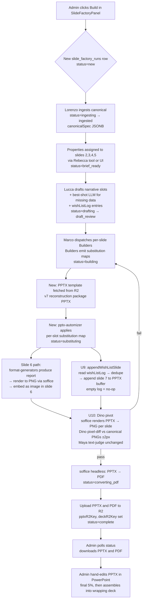

# Factory v2 — agent-native PPTX-substitution rewrite of the slide factory

## Summary

Pivot the slide factory's render path from React+Playwright HTML→PDF to **PPTX template substitution → LibreOffice headless export**. Reuse the existing `slide_factory_runs` schema and Marco/Builder/Inspector/Lucca/Maya roster; replace only the Renderer layer. Output becomes dual-format (PPTX + PDF) so the admin can hand-edit the final 5% in PowerPoint. Remove the mid-flight admin gate; add best-shot LLM judgment for missing narrative data; embed slide 6's income statement as an image via the existing report-export pipeline; append a wish-list slide capturing what the app should track for better next runs.

---

## Problem Frame

Today's factory produces one PDF rendered by Playwright from React components hand-coded against the canonical PNGs. Three problems compound:

1. **PDF-only output blocks hand-editing.** When the factory's output is "nearly perfect" with a few off numbers or text-overflow cases, the admin can't open PowerPoint and fix the last 5% — the PDF is final. Factory v2 keeps the admin in the loop *after* download, not before.
2. **Renderer drift from canonical.** React+Playwright coordinates are hand-derived from canonical PNGs; every canonical refresh requires manual reconciliation in `slides.tsx` (saw this today on the v7 canonical refresh). The v7 reconstruction package's source PPTX (`L+B Property Slides 03.pptx`) is the layout truth — substituting INTO it eliminates the hand-derivation step.
3. **Mid-flight admin gating slows runs and adds no value.** The current Tab 4 "vet Lucca's draft" step lets the admin tweak before render; the v2 contract favors "factory runs to completion; admin hand-edits the output" because PPTX is editable downstream.

The v7 reconstruction package GPT produced today (R2 `canonical/lb-6-slide/packages/lb_property_reconstruction_package_v7_cleaned_instructed.zip`) is the catalyst — it makes the PPTX-as-truth shape viable in a way the OpenAI-5.5 JSON track never did.

This plan supersedes the relevant parts of `docs/solutions/architecture-patterns/slide-deck-generation-decision-reversal-2026-05-03.md` (which closed the PPTX track on 2026-05-03 in favor of Playwright-only). What changed: the v7 reconstruction package supplies canonical PPTX + per-slide bbox/object manifest as structural truth, eliminating the satori/sharp fidelity gap that motivated the original reversal.

---

## Requirements

- R1. Identity baseline: a no-change run reproduces the canonical 6-slide deck in both PPTX and PDF, cleanly, with footers and titles intact.
- R2. Dual-format output: every run produces a downloadable PPTX *and* a PDF; the PDF is exported FROM the PPTX (not rendered independently), so the two cannot drift.
- R3. PPTX-as-truth: the v7 reconstruction package's source PPTX is the structural template; substitution writes property-specific data into a copy of it. No regenerate-from-scratch.
- R4. No mid-flight admin gating: the factory runs from kickoff to "ready for download" without admin approval steps mid-pipeline. Admin sees the finished deck; hand-edits in PowerPoint if needed.
- R5. Best-shot LLM judgment for missing narrative data: when a slot needs information the app doesn't natively produce (e.g., Slide 3 "Transformation" describing how a budget reshapes a property), the factory prompts an LLM with the full property context and inserts a plausible answer. Never asks the admin.
- R6. Embedded-report pattern: slide 6's income statement (and any future heavy-data slide) is produced via the app's existing report-exporter (`format-generators/*`), rendered to PNG, and embedded as an image in the slide. Aspect ratio preserved; positioned on top of other elements; never collides with title or footer.
- R7. Aesthetic guardrails: titles, body text, and footers must respect the canonical typography hierarchy. Overflow handled by font-tightening / wrapping / abbreviation; layout is never broken to fit content. Footers remain unchanged across runs.
- R8. Wish-list slide: a final appended slide (after slide 6) lists data the app does NOT currently track but would have enabled a more accurate run. Each entry: missing data point + why it would help. Derived from the per-run "had to best-shot this" log.
- R9. Generous time/resource budget: precision over speed. Builders use the right model tier per task; the pipeline does not aggressively downgrade to save tokens.
- R10. Single PPTX file delivered: factory output is one PPTX containing all 7 slides (6 canonical + wish-list) plus the PDF exported from it. The admin assembles the wrapping presentation in PowerPoint manually.
- R11. Slide-1 architecture: slide 1 is a multi-property overview (no single-property assignment); slide 4 gains a single-property assignment (Hazelnis Retreat in the current canonical set). Schema reflects this.
- R12. Structural-data failure mode: when a property assigned to a slide is missing structural data (name, location, or at least one photo), the factory fails the run with a clear error. Best-shot LLM applies to NARRATIVE content only.
- R13. Agent-native parity: every admin UI action — kickoff, status check, download, cancel, view run history, view wish-list — exposed via Rebecca tool. Parity map updated in the same PR as the UI change.
- R14. CSRF compliance: every admin write goes through `apiRequest()`; raw `fetch()` for admin writes is forbidden (would 403 under live enforce mode). Polling queries use the default queryFn pattern from `react-query-apiRequest-querykey-convention-2026-05-05`.
- R15. No regression on financial engine authoring: this plan does not touch `lib/engine/src/`, `lib/calc/src/`, `lib/shared/src/constants*.ts`, `lib/db/src/constants*.ts`, `artifacts/api-server/src/finance/`, or `artifacts/api-server/src/report/` — except to **call** the report-exporter as a black box for slide 6.

---

## Scope Boundaries

- Renato (canonical extractor agent) — deferred to next canonical refresh; not built in this plan. See `memory/project_renato_deferral.md`.
- Sources admin UI redesign and 4-level grading indicators — separate planning track (overlaps with the deferred constants/defaults reference architecture).
- Constants/defaults reference architecture (Lucia agent, currency-pair, table-sourced values overhaul) — separate plan.
- The wrapping presentation outside the 6-slide insert — assembled by the admin in PowerPoint externally; factory does not modify it.
- Mid-run cancel/pause UX beyond a simple "cancel running build" tool — no granular per-step cancel.
- Multi-canonical version management (v8 onward) — Renato's territory when revived.
- Editing the report-exporter pipeline's internals — factory uses `format-generators/*` as a black box.
- Real-time progress streaming UI — admin polls run status or sees completion notification; no SSE/websocket progress feed.
- Cost optimization beyond "precision over speed".
- Building Figma AI / Claude for Excel / Claude for PowerPoint integrations — watch-list only; not approved deps. A capability check on Claude for PowerPoint fires in U1; if compelling, it can supersede the chosen substitution library, but the plan's default is `pptx-automizer`.

### Deferred to Follow-Up Work

- Bringing forward the v7 canonical-refresh artifacts from `feat/csrf-mig-3-scenarios` (Replit's batch of canonical PNG/PDF/script updates) — handled by a separate cherry-pick PR before this plan's U2 (Docker) can run end-to-end. The plan units assume the v7 PPTX is reachable in R2; if not yet, the cherry-pick is a prerequisite, not a unit.
- A `/ce-compound` learning doc on **soffice/LibreOffice headless on Railway** (install layer, fonts, conversion contract, exit-code mapping) — captured during/after U2 and U8.
- A `/ce-compound` learning doc on **PPTX template-substitution fidelity** — captured during/after U4–U5.
- A `/ce-compound` learning doc on **Drizzle two-phase column drop** runbook — captured during/after U3 if the column-drop pattern surfaces non-trivial gotchas.

---

## Context & Research

### Relevant Code and Patterns

- `artifacts/api-server/src/routes/lb-deck-pdf.ts` — current LB-deck render route. In-memory status (idle/rendering/ready/error) resets on restart. Becomes legacy after U10–U11; keep for backwards compatibility during the rollout; deprecate in a follow-up PR.
- `artifacts/api-server/src/routes/slide-factory.ts` — current V2 wizard route surface, already wired to `slide_factory_runs`. Factory v2 extends this rather than replacing.
- `artifacts/api-server/src/slides/build-lb-payload.ts` lines 44–130 (`buildUsaliTableHtml`) and line 325 (`renderUsaliTablePng`) — **the precedent for "structured report → PNG → embedded in slide".** U6 lifts this into a shared module.
- `artifacts/api-server/src/slides/marco.ts`, `lucca-draft.ts`, `lorenzo-vision.ts`, `lorenzo-ingestion.ts`, `maya.ts`, `rebuild-maya.ts`, `dino-render.ts`, `dino.ts`, `swarms/*`, `minions/*` — current Marco/Lucca/Lorenzo/Maya/Dino/Builders. Builders refactor; Lorenzo's pipeline reused (Lorenzo already produces `LorenzoCanonicalSpec` that becomes the substitution-map source-of-truth).
- `artifacts/api-server/src/routes/format-generators/{pptx,excel,docx}-generator.ts` — public surface: `generateXFromReport(report: ReportDefinition): Promise<Buffer>`. Used as black-box black-box for slide 6.
- `artifacts/api-server/src/chat/rebecca-tool-defs-slide-factory.ts` + `rebecca-tool-impls-slide-factory.ts` — already-shipped V2 wizard tool surface. Extended in U12.
- `artifacts/api-server/src/chat/rebecca-tool-defs-deck.ts` + `rebecca-tool-impls-deck.ts` — legacy LB-deck tools. Marked deprecated; not removed in this plan (backwards compat).
- `lib/db/src/schema/slide-factory-runs.ts` — already has `slide{1,2,3,5}PropertyId` FK columns with `ON DELETE SET NULL`, 10-status enum, JSONB for `canonicalSpec`/`luccaDraft`/`agentResults`. Extended in U3 (add `slide4PropertyId`, drop `slide1PropertyId`, extend status enum, add `wishListLog` JSONB, add `pptxR2Key`).
- `lib/db/src/schema/lb-slides-config.ts` — single-row legacy config table. **Marked for removal in a follow-up PR** (not in this plan); columns are superseded by `slide_factory_runs`.
- `artifacts/hospitality-business-portal/src/pages/LbSlides.tsx` — admin UI; **lower 7-tab section currently uses raw `fetch()` with `credentials: include`** (CSRF risk under live enforce mode). U11 either migrates writes to `apiRequest()` or removes the section in favor of the V2 wizard.
- `artifacts/hospitality-business-portal/src/features/slide-factory/SlideFactoryPanel.tsx` — V2 wizard, already-shipped frontend. Extended in U11.
- `Dockerfile` — runtime stage starts line 67. **No LibreOffice/soffice/fonts present today.** U2 adds them.
- `.agents/skills/slide-factory/SKILL.md` and `teams/*` and `minions/minions.md` — current factory roster. Franco exists in code (`runFranco` in `slide-factory.ts:573`) but is missing from SKILL.md — U13 fixes the drift.
- `docs/discipline/agent-native-parity-map.md` — parity map; rows for factory v2 tools updated in U12.

### Institutional Learnings

- `docs/solutions/architecture-patterns/slide-deck-generation-decision-reversal-2026-05-03.md` — **the prior decision this plan reverses.** Update the doc's `status:` field as part of U13. State the catalyst (v7 reconstruction package) explicitly.
- `docs/solutions/architecture-patterns/slide-factory-runs-schema-design-2026-05-07.md` — authoritative for the `slide_factory_runs` table shape. Extend the status enum via CHECK constraint update + runtime guard; do not create a parallel `slide_factory_v2_runs`.
- `docs/solutions/architecture-patterns/canonical-contract-rebuild-architecture-2026-05-03.md` — Schema/Theme/Renderer/Builder four-layer architecture. PPTX-substitution does not delete layers 1–3; they relocate into the template + substitution map. Slot-specific schemas still validate.
- `docs/solutions/architecture-patterns/agent-native-precision-pipeline-pattern-2026-05-06.md` — Marco + per-slide Builders + hybrid Inspector + 10 hallucination defenses. Preserved unchanged; the Renderer layer is what swaps.
- `docs/solutions/architecture-patterns/lorenzo-vision-pipeline-canonical-ingestion-2026-05-07.md` — Lorenzo already ingests canonical PDFs into `LorenzoCanonicalSpec`. The v7 PPTX consumption is **additive** — Lorenzo's spec still drives Builder semantics; the PPTX is the substitution target.
- `docs/solutions/architecture-patterns/lb-deck-composite-payload-architecture-2026-05-04.md` — one composite payload → one render pass → one R2 key. Factory v2 honors: one substituted PPTX → one soffice convert → one PDF → one R2 upload for each format.
- `docs/solutions/conventions/react-query-apiRequest-querykey-convention-2026-05-05.md` — every admin mutation through `apiRequest()`; queries use the default queryFn. Hard constraint for U11.
- `docs/solutions/database-issues/drizzle-migration-state-drift-missing-tables-2026-05-07.md` — `slide_factory_runs` was affected; migrations on this table use `pnpm --filter @workspace/db run generate` + runtime `IF NOT EXISTS` guard + verify against live Neon DB (not Replit `executeSql`).
- `docs/solutions/performance-issues/api-server-bundle-size-externalize-heavy-deps-2026-05-02.md` — `pptxgenjs` already externalized; if U1 adopts `pptx-automizer`, add it to the externals list (`artifacts/api-server/build.mjs`) and verify bundle stays ~7.5 MB.
- `docs/solutions/conventions/no-hardcoded-integration-identifiers-convention-2026-05-09.md` — soffice binary path, conversion timeout, GPT v7 template R2 key, soffice flags all live in `admin_resources` or `admin_parameters`, not in source `const`s.
- `docs/solutions/workflow-issues/slide-factory-pre-merge-shipping-gates-2026-05-08.md` — every unit gates on: typecheck, magic-numbers, Vitest, agent-native parity, memory-file harmonization.
- `MEMORY.md / project_csrf_rollout_state.md` — CSRF enforce live; raw fetch for admin writes 403s.

### External References

- `docs/slide-system/slide-factory-toolkit-suggestions.md` — stage-by-stage toolkit catalog. (Lives on `feat/csrf-mig-3-scenarios`; cherry-pick prerequisite — see Deferred to Follow-Up Work). Primary picks adopted from the memo: LibreOffice headless (Stage 9), `pptxgenjs` for new-deck building (Stage 8, already in repo), `pixelmatch + pngjs` for visual diff (Stage 10). Re-scored for v2: `pptx-automizer` displaces `pptxgenjs` as primary for *substitution-on-existing-PPTX* (memo treats Stage 8 as build-from-scratch).
- `memory/project_factory_v2_contract.md` — the 9-rule contract; the deck-shape clarifications (6-slide insert into larger presentation, no cover, slide 1 = portfolio overview, slide 4 = Hazelnis, etc.).
- `memory/project_factory_vs_gpt_decomposition.md` — multi-stage factory beats one-shot LLM; LLM judgment carved out of deterministic work.
- `memory/reference_external_ai_tools_for_factory.md` — Figma AI, Claude for Excel, Claude for PowerPoint watch list.

---

## Key Technical Decisions

- **PPTX-as-truth, not React-as-truth.** The v7 reconstruction package's `sources/L+B Property Slides 03.pptx` is the structural template; substitution writes property data into a copy. Replaces the hand-derived TSX coordinate constants in `slides.tsx`.
- **`pptx-automizer` as default substitution library.** TS, MIT, purpose-built for modify-existing-PPTX workflows. `pptxgenjs` (which is build-from-scratch) is retained for any greenfield slide work but not used for v2's substitution path. Claude for PowerPoint is checked in U1 as a possible superior choice; if available with a programmatic substitution API and Railway-compatible, it can substitute. Default remains `pptx-automizer` unless U1 produces evidence to pivot.
- **Reuse `slide_factory_runs`, do not fork.** Extend the status enum (add `substituting`, `converting_pdf`) and add columns (`slide4PropertyId`, `wishListLog`, `pptxR2Key`) via runtime guards. Drop `slide1PropertyId` in a paired guard (two-phase: backfill any existing rows' NULL meaning, drop next deploy).
- **Embedded-report pattern, not native-table render.** Slide 6's income statement: `format-generators/excel-generator.ts` (or `pptx-generator.ts` per pipeline taste) produces the report buffer → render to PNG via soffice headless or Playwright HTML→PNG → embed as image into slide-6 PPTX shape. Avoids the historical "spreadsheet-UI-in-a-slide" anti-pattern.
- **Best-shot LLM = Lucca extension.** Lucca already drafts narrative copy with citation discipline; extend Lucca to detect missing-data slots, prompt with full property context (purchase price, location, acreage, room counts, business model, budget, assumptions), and emit slot text + a "had to best-shot this" log entry. No new agent.
- **Wish-list slide = post-completion synthesis step.** After all 6 slides substituted and slide 6 income statement embedded, a final agent step reads the `wishListLog` JSONB on the run record, generates a 7th slide via PPTX substitution (using a wish-list template appended to the PPTX), and inserts it before final PDF conversion.
- **Visual inspection via PPTX-rendered PNG.** Maya/Dino's diff baseline shifts from React-rendered PNG to PPTX→soffice→PNG. Same canonical PNG references from the v7 `powerpoint_pngs/` directory; same `pixelmatch ±2px` tolerance. Bruno (Playwright-PNG) is repurposed for preview only.
- **LibreOffice/soffice headless as conversion backbone.** Added to the Dockerfile runtime stage with Noto/Liberation/Georgia/Poppins fonts. Conversion contract: `soffice --headless --convert-to pdf --outdir <tmp> <input.pptx>`. Timeout, font-fallback behavior, and exit-code mapping defined in U2.
- **CSRF + React-Query convention is non-negotiable.** Every admin write uses `apiRequest()`. Polling queries omit `queryFn` and let the default join `queryKey` segments into a URL. Verified per unit.
- **One PPTX file = 7 slides.** Wish-list slide is appended to the same PPTX, not a separate file. PDF exported from the unified PPTX.
- **The legacy `LbSlides.tsx` lower 7-tab section is migrated, not deleted.** U11 migrates the raw-fetch writes to `apiRequest()` (CSRF compliance) without removing the tabs in this plan; deletion follows once the V2 wizard reaches parity in a follow-up.

---

## Open Questions

### Resolved During Planning

- Q: Which PPTX substitution library? → Default `pptx-automizer`; capability check on Claude for PowerPoint in U1 may supersede.
- Q: Where does the wish-list log live during a run? → New `wishListLog` JSONB column on `slide_factory_runs`. Lucca appends entries during draft; wish-list slide generator consumes at end.
- Q: Schema for slide-property assignments under v2? → Drop `slide1PropertyId` (slide 1 is multi-property overview); add `slide4PropertyId` (Hazelnis spotlight); keep `slide{2,3,5}PropertyId`; slide 6 stays no-property.
- Q: What happens if a property is missing critical data? → Run fails with clear error (R12). Best-shot LLM applies to NARRATIVE only.
- Q: Soffice install location? → Dockerfile runtime stage; verified during Railway image build.
- Q: How does the admin trigger a run? → On-demand via the V2 wizard's existing "Build" button; status polled; deck downloaded when complete. No scheduling in this plan.
- Q: Status enum new values? → `substituting` (PPTX template-fill in progress), `converting_pdf` (soffice export in progress).

### Deferred to Implementation

- Exact slot mapping between `LorenzoCanonicalSpec` (per-slot fields) and PPTX shape IDs in the v7 template — U4 derives this at implementation time by reading the v7 PPTX's slide XML, since the shape IDs are file-specific.
- Wish-list slide template — needs to be added to the v7 PPTX as a hidden 7th slide or appended dynamically. U9 decides; depends on whether `pptx-automizer` supports cross-PPTX slide append vs. inline shape addition.
- Soffice headless retry policy — first-pass timeout + retry count derived during U8 from measured conversion times; conservative defaults applied initially, tunable via `admin_parameters` row.
- Slide-6 image dimensions and bbox in the PPTX template — U6/U7 measure the existing slide-6 shape bbox in the v7 PPTX and size the rendered report PNG to match.
- Whether Lucca's best-shot prompt template lives in code or in an `admin_resources` row — U8 default is code (versioned with the agent) unless a strong case for runtime tunability surfaces.

---

## High-Level Technical Design

> *This illustrates the intended approach and is directional guidance for review, not implementation specification. The implementing agent should treat it as context, not code to reproduce.*

Key state transitions: `new → ingesting → ingested → brief_ready → drafting → draft_review → building → substituting → converting_pdf → complete`. Error states branch to `error` from any stage and persist the failing stage in the run record for debug.

---

## Implementation Units

### Phase A — Foundation

- U1. **Substitution library decision spike**

**Goal:** Decide between `pptx-automizer`, Claude for PowerPoint, and (fallback) raw `unzip + fast-xml-parser` for PPTX template substitution. Land the decision in a docs/solutions entry and a 50–100-line proof-of-concept that loads the v7 PPTX, swaps one text run and one image on slide 2, and saves.

**Requirements:** R3, R7.

**Dependencies:** None (parallel-safe with U2).

**Files:**
- Create: `scripts/src/pptx-substitution-spike.ts` (throwaway POC; deleted after decision)
- Create: `docs/solutions/architecture-patterns/pptx-substitution-library-decision-2026-05-11.md`
- Modify: `package.json` (add chosen library to api-server)

**Approach:**
- Stand up a Claude-for-PowerPoint capability check first (does it exist? is it Railway-compatible? does it expose programmatic substitution?). If yes and quality acceptable → adopt as primary, fall back to `pptx-automizer` if Claude-PPT API is unstable.
- Otherwise default to `pptx-automizer` (TS, MIT, purpose-built for "modify existing PPTX").
- POC: load v7 PPTX from local copy, swap one text run ("Belleayre Mountain" property name placeholder), swap one embedded image, save as new file, verify with `unzip -l` that the structure is intact.
- Document the decision: chosen library, why, performance benchmark, license, externals-list impact.

**Patterns to follow:**
- `docs/solutions/architecture-patterns/slide-deck-generation-decision-reversal-2026-05-03.md` (decision-record format).
- `artifacts/api-server/build.mjs` externals list (if library is bundled).

**Test scenarios:**
- Happy path: POC produces a valid output PPTX, opens cleanly in LibreOffice + PowerPoint, displays the substituted text and image.
- Edge case: substituting a text run longer than the original — verify the library's overflow behavior matches our aesthetic guardrails (R7).
- Test expectation: spike unit; primary deliverable is the decision doc and library selection.

**Verification:**
- A decision doc lives at `docs/solutions/architecture-patterns/pptx-substitution-library-decision-2026-05-11.md` with the chosen library and rationale.
- The chosen library is in `artifacts/api-server/package.json`.
- The POC produces an output PPTX that opens cleanly and shows the substituted content.

---

- U2. **Add LibreOffice headless to Dockerfile + Railway verification**

**Goal:** Install LibreOffice (`libreoffice-impress` or `libreoffice-core`), Noto/Liberation/Georgia/Poppins fonts in the Dockerfile runtime stage. Verify the Railway image builds and `soffice --version` works in the running container.

**Requirements:** R2, R6.

**Dependencies:** None.

**Files:**
- Modify: `Dockerfile`
- Modify: `docs/deployment/railway-image-notes.md` (or create if absent — flag during execution)
- Create: `docs/solutions/integration-issues/libreoffice-headless-railway-install-2026-05-11.md`

**Approach:**
- Add `RUN apt-get update && apt-get install -y --no-install-recommends libreoffice-impress fonts-liberation fonts-noto-core fonts-noto-cjk && rm -rf /var/lib/apt/lists/*` to the runtime stage.
- Verify the image size delta is acceptable (~200 MB expected; flag if >500 MB).
- Add a smoke test: `soffice --headless --convert-to pdf <tiny.pptx>` runs and produces a valid PDF.
- Document install layer, image-size delta, font choices, and known fidelity caveats vs. real PowerPoint.

**Patterns to follow:**
- The Playwright install line in `Dockerfile` (existing pattern for system-binary deps with `playwright install --with-deps chromium`).

**Test scenarios:**
- Happy path: Docker build succeeds; running container responds to `soffice --version`.
- Integration: build a 1-slide test PPTX in CI, run `soffice --headless --convert-to pdf`, verify exit code 0 and output PDF is non-zero size.
- Error path: malformed PPTX input → soffice exits non-zero; verify error message is captured cleanly.

**Verification:**
- `docker build` succeeds with the new layer.
- Railway image deploys; the running pod has `soffice` on PATH.
- A captured Vitest integration test confirms the smoke-conversion roundtrip.

---

- U3. **Schema migration: extend `slide_factory_runs`**

**Goal:** Drizzle migration that drops `slide1PropertyId`, adds `slide4PropertyId` (FK properties, `ON DELETE SET NULL`), adds `wishListLog` JSONB (default `[]`), adds `pptxR2Key` text (nullable), and extends the status CHECK constraint to allow `substituting` and `converting_pdf`. Paired runtime guard.

**Requirements:** R10, R11, R8.

**Dependencies:** None.

**Files:**
- Modify: `lib/db/src/schema/slide-factory-runs.ts`
- Create: `lib/db/migrations/NNNN_factory_v2_runs_columns.sql` (generated)
- Create: `artifacts/api-server/src/migrations/slide-factory-runs-v2-columns.ts` (runtime guard)
- Modify: `artifacts/api-server/src/migrations/migration-guards.json`
- Test: `artifacts/api-server/src/tests/migrations/slide-factory-runs-v2-columns.test.ts`

**Approach:**
- Two-phase column drop for `slide1PropertyId` per the `drizzle-migration-state-drift-missing-tables-2026-05-07` learning: this PR adds the new columns and stops *reading* `slide1PropertyId`; a follow-up PR drops the column once no code reads it. Mark the column with a `// TODO: drop in PR #<n+1>` comment.
- Status CHECK extension via `ALTER TABLE … DROP CONSTRAINT … ADD CONSTRAINT … CHECK (status IN (…))` — verified against Neon directly per the schema-drift learning.
- Runtime guard re-applies the column add + CHECK update with `IF NOT EXISTS` so dev DBs heal on boot.

**Patterns to follow:**
- Other runtime guards under `artifacts/api-server/src/migrations/`.
- The two-phase pattern: this PR stops *reading* the deprecated column; the next PR drops it.

**Test scenarios:**
- Happy path: migration applies cleanly on a fresh DB; new columns present with correct types and defaults.
- Edge case: migration re-applies on a DB that already has the columns (idempotency).
- Integration: insert a run row with `status='substituting'` succeeds; `status='invalid_status'` rejected by CHECK.
- Error path: migration fails gracefully if the table is locked; rollback leaves DB in prior state.

**Verification:**
- Drizzle migration applies cleanly on dev DB.
- Runtime guard runs without error on boot.
- Inserting a row with `wishListLog: []` and `slide4PropertyId` referencing a property succeeds.

---

### Phase B — Render Pipeline Core

- U4. **PPTX template fetch + substitution engine**

**Goal:** New module that fetches the v7 reconstruction-package PPTX from R2, loads it into the chosen substitution library (from U1), and exposes a `substituteSlots(template, substitutionMap): Buffer` function. The substitution map shape is per-slot: text runs, table cells, image swaps, keyed by slide+shape identifier.

**Requirements:** R3, R7.

**Dependencies:** U1, U2 (soffice for round-trip validation).

**Files:**
- Create: `artifacts/api-server/src/slides/pptx-substitution.ts`
- Create: `artifacts/api-server/src/slides/pptx-substitution-types.ts` (Zod schema for substitution map)
- Test: `artifacts/api-server/src/tests/slides/pptx-substitution.test.ts`

**Approach:**
- R2 key for the v7 template lives in `admin_resources` (kind `canonical_template`) — no hardcoded R2 keys per `no-hardcoded-integration-identifiers-convention-2026-05-09`.
- Substitution map: `{ slideNumber: number, shapeId: string, op: 'text' | 'image' | 'table_cell', payload: ... }[]`. Carlo validates the map against the schema before applying.
- Aesthetic guardrail enforcement: text-overflow detection via the library's bbox info — if substituted text exceeds the original shape's char budget by >5%, apply font-tighten/wrap rules; if still over by >20%, abort with a clear "slot overflow" error to surface upstream.

**Execution note:** Implement test-first — the substitution map schema and overflow rules are the contract; the library binding is the implementation detail.

**Patterns to follow:**
- `artifacts/api-server/src/slides/build-factory-payload.ts` (existing factory payload shape; substitution map is the v2 analogue).
- Carlo's Zod-validation pattern in `slot-output-validator.ts`.

**Test scenarios:**
- Happy path: load v7 template, substitute slide 2's property name + hero image, save → output opens cleanly, shows new content.
- Edge case: text run shorter than original — preserves trailing run formatting.
- Edge case: text run longer than 5% but within 20% of original — overflow detection triggers font-tighten path; output still fits.
- Error path: text run >20% over original budget — substitution aborts with `SLOT_OVERFLOW` error naming slide + shape.
- Error path: invalid substitution map (missing shapeId) — Carlo rejects before any I/O.
- Edge case: image swap with mismatched aspect ratio — preserves the slot's bbox; image scaled to fit (letterbox or crop per per-slot rule).

**Verification:**
- Substituting a known map produces an output PPTX that opens cleanly and matches expected content.
- Overflow detection fires the expected errors on synthetic inputs.

---

- U5. **`ReportDefinition → PNG` shared renderer**

**Goal:** Lift the inline `renderUsaliTablePng` pattern from `build-lb-payload.ts` into a shared module that takes a `ReportDefinition`, produces HTML (via the existing `format-generators` HTML path if exposed, otherwise a thin wrapper), renders to PNG via Playwright at 2x DPR, returns the PNG buffer.

**Requirements:** R6.

**Dependencies:** None.

**Files:**
- Create: `artifacts/api-server/src/slides/render-report-png.ts`
- Modify: `artifacts/api-server/src/slides/build-lb-payload.ts` (replace inline `renderUsaliTablePng` with import from the new module)
- Test: `artifacts/api-server/src/tests/slides/render-report-png.test.ts`

**Approach:**
- Signature: `renderReportToPng(report: ReportDefinition, options: { widthPx, heightPx, dpr }): Promise<Buffer>`.
- Reuse `getBrowser()` from `playwright-browser.ts`.
- HTML template mirrors the financial-table HTML in current `buildUsaliTableHtml` but generalized for any `ReportDefinition`'s `sections[]`.

**Execution note:** Characterization-first — capture the current `renderUsaliTablePng` output as a baseline PNG; verify the refactored module produces a byte-equivalent or pixel-diff-tolerated output.

**Patterns to follow:**
- `artifacts/api-server/src/slides/build-lb-payload.ts:44-130` (the inline pattern being lifted).
- `artifacts/api-server/src/slides/dino-render.ts` for headless render scaffolding.

**Test scenarios:**
- Happy path: pass an income-statement `ReportDefinition` → returns a non-empty PNG buffer matching the expected dimensions.
- Edge case: 10-year vs 5-year column count — both render without column-overflow.
- Edge case: empty report (zero sections) — returns a placeholder PNG, not an error.
- Integration: the refactored `build-lb-payload` produces a slide 6 PNG indistinguishable (within ±2px tolerance) from the pre-refactor output.

**Verification:**
- Existing slide-6 USALI rendering still passes its acceptance test post-refactor.
- The new module is the only place that produces report PNGs in the api-server.

---

- U6. **Slide-6 income-statement embed flow**

**Goal:** Wire the embedded-report pattern: at slide-6 substitution time, the pipeline calls `renderReportToPng` (from U5) with the run's `ReportDefinition` (sourced from `format-generators` callers or constructed from engine output), gets the PNG, and substitutes it into slide 6's image shape in the PPTX template.

**Requirements:** R6, R7.

**Dependencies:** U4 (substitution engine), U5 (report PNG renderer).

**Files:**
- Modify: `artifacts/api-server/src/slides/marco.ts` (slide-6 step calls renderReportToPng + substitution)
- Modify: `artifacts/api-server/src/slides/build-factory-payload.ts` (slide-6 substitution map entry)
- Create: `artifacts/api-server/src/slides/slide-6-report-builder.ts` (builds the ReportDefinition for slide 6 from engine output)
- Test: `artifacts/api-server/src/tests/slides/slide-6-report-builder.test.ts`
- Test: `artifacts/api-server/src/tests/integration/slide-6-embed-flow.test.ts`

**Approach:**
- `slide-6-report-builder.ts` consumes the run's properties + global assumptions, calls the engine (read-only) to produce 10-year projections, formats as `ReportDefinition`.
- Slide-6 substitution map entry uses `op: 'image'` with the rendered PNG buffer as payload.
- Image bbox must match the v7 template's slide-6 image shape — measured in U4 and parameterized.

**Patterns to follow:**
- Current `buildSlide6Payload` in `build-lb-payload.ts:218`.
- `format-generators` callsites for `ReportDefinition` construction.

**Test scenarios:**
- Happy path: portfolio with 3 properties → slide 6 PNG contains a 10-year P&L; embedded in slide 6 of the output PPTX.
- Edge case: 10-year column count produces wider table than 5-year — renderer letterboxes or scales; verify image fits slide-6 bbox.
- Error path: engine produces NaN/null cell — report renderer surfaces an "incomplete data" PNG with clear messaging instead of `######`.
- Integration: full slide-6 substitution path from `ReportDefinition` → PNG → embedded in slide-6 shape; output PPTX opens with slide 6 showing the table image.

**Verification:**
- End-to-end test produces an output PPTX where slide 6 displays the 10-year income statement image at the correct bbox.
- Engine + report-exporter remain untouched (factory v2 is a black-box consumer).

---

- U7. **`soffice` PPTX → PDF subprocess wrapper + R2 upload**

**Goal:** Module that spawns `soffice --headless --convert-to pdf` on a substituted PPTX, captures stdout/stderr, handles timeouts, retries on transient failures, uploads both PPTX and PDF to R2, returns both R2 keys.

**Requirements:** R2, R10.

**Dependencies:** U2 (soffice installed), U4 (PPTX produced).

**Files:**
- Create: `artifacts/api-server/src/slides/soffice-convert.ts`
- Create: `artifacts/api-server/src/slides/factory-v2-upload.ts`
- Test: `artifacts/api-server/src/tests/slides/soffice-convert.test.ts`

**Approach:**
- Subprocess via `node:child_process.spawn`; timeout from `admin_parameters` row (default conservative — set during U8 measurement).
- Output dir is `/tmp/factory-runs/<runId>/`; cleanup after R2 upload.
- R2 keys: `factory-v2/runs/<runId>/deck.pptx` and `factory-v2/runs/<runId>/deck.pdf`. Keys live in code; the R2 bucket itself is in `admin_resources` per existing pattern.
- Retry once on exit code 1 with fresh tmp dir.

**Patterns to follow:**
- `artifacts/api-server/src/slides/playwright-browser.ts` for subprocess discipline.
- R2 upload pattern from current `lb-deck-pdf.ts:49`.

**Test scenarios:**
- Happy path: well-formed PPTX → PDF produced, both uploaded to R2, both R2 keys returned.
- Edge case: PPTX with unusual font — soffice falls back to closest installed font; output PDF generated; conversion contract documents acceptable fidelity loss.
- Error path: timeout exceeded → first retry succeeds → return both keys.
- Error path: both attempts fail → error surfaces upstream, run record marked `error`, partial files cleaned up.
- Edge case: large PPTX (slide 6 with high-DPI report image) — verify conversion completes within timeout; if not, surface a "conversion too slow" runtime telemetry note for the timeout to be tuned.

**Verification:**
- Integration test produces a downloadable PDF from a synthesized PPTX.
- R2 keys are queryable post-upload; cleanup confirmed.

---

### Phase C — Agent Rewiring

- U8. **Lucca best-shot LLM + Builder substitution-map output**

**Goal:** Extend Lucca to detect missing-data slots, prompt with property context, emit slot text + a `wishListLog` entry per best-shot decision. Refactor per-slide Builders (Sofia, Bianca, Chiara, Dario, Elisa, Felix) to emit substitution maps (the U4 schema shape) instead of React-component payloads.

**Requirements:** R5, R8, R9.

**Dependencies:** U4 (substitution map schema).

**Files:**
- Modify: `artifacts/api-server/src/slides/lucca-draft.ts` (add best-shot detection + log emission)
- Modify: `artifacts/api-server/src/slides/swarms/*-builder.ts` (each slide team's Builder; refactor output shape)
- Modify: `artifacts/api-server/src/slides/marco.ts` (orchestrate Builders' new output)
- Create: `artifacts/api-server/src/slides/lucca-best-shot-prompt.ts` (the prompt template; lives in code per Open Question resolution)
- Test: `artifacts/api-server/src/tests/slides/lucca-best-shot.test.ts`
- Test: `artifacts/api-server/src/tests/slides/builder-substitution-map.test.ts`

**Approach:**
- Lucca's per-slot draft step gains a "data sufficiency" check: if the slot needs data the property doesn't have, mark the slot as "best-shot", call the LLM with full property context + the slot's intent, emit text, log the gap.
- Builders no longer build React props; they build substitution-map entries `{ slideNumber, shapeId, op, payload }`. Marco assembles all Builders' outputs into one substitution map for U4.
- Prompt template uses Opus 4.7 (highest-quality tier) per the "generous budget" rule.

**Execution note:** Test-first for Lucca's best-shot detection — the data-sufficiency rules are the contract.

**Patterns to follow:**
- Current `lucca-draft.ts` for narrative drafting + citations.
- Current `slot-output-validator.ts` (Carlo) for output validation.

**Test scenarios:**
- Happy path: slot with full data — Lucca produces normal draft; no `wishListLog` entry.
- Happy path (best-shot): slot with missing data (Slide 3 Transformation, no transformation data) — Lucca produces a plausible narrative AND logs the gap with the missing field name and a one-line "why this would help."
- Edge case: property has partial data (e.g., budget but no acreage) — Lucca uses what's available; logs only the genuinely missing fields.
- Error path: LLM call fails — Lucca retries once, then surfaces a "draft generation failed" error to Marco.
- Integration: Marco assembles outputs from all six slide Builders into one valid substitution map; Carlo validates.

**Verification:**
- A run with intentionally missing Slide-3 transformation data produces both a narrative slot text AND a `wishListLog` entry naming the gap.
- Builders' outputs assemble into a Carlo-valid substitution map.

---

- U8b. **Pipeline wire-up: `produce_deck` → substituteSlots + soffice + R2**

**Goal:** Wire the existing U4/U7 modules into the production Marco pipeline. Replace `produce_deck`'s Franco call with `getAssembledSubstitutionMap` → `substituteSlots` → `appendWishListSlide` (U9 hook) → `runSofficeConvert` → `uploadFactory2Deck`. Mark Franco as legacy. This is a call-site change only — do not re-implement any module from U4/U7.

**Context:** U8 shipped `apply_substitutions` (Marco tool that assembles and caches the substitution map via `getAssembledSubstitutionMap`). The existing modules `substituteSlots` (`pptx-substitution.ts`), `runSofficeConvert` (`soffice-convert.ts`), and `uploadFactory2Deck` (`factory-v2-upload.ts`) all exist but have zero production callers — `produce_deck` still calls `runFranco`. U8b is the missing bridge. The tests for U8 covered map *assembly* (`apply_substitutions` + `assembledSubstitutionMaps` cache), not map *consumption*, which is why the wiring gap was not caught by the existing test suite.

**Requirements:** R2, R3, R10.

**Dependencies:** U4, U7, U8.

**Files:**
- Modify: `artifacts/api-server/src/slides/marco-tools.ts` (`handleProduceDeck`: replace `runFranco` call with substituteSlots → appendWishListSlide → runSofficeConvert → uploadFactory2Deck; update status transitions: `substituting` then `converting_pdf` then `complete`)
- Modify: `artifacts/api-server/src/slides/marco.ts` (remove any system-prompt language referencing Franco or React render; verify the `apply_substitutions → produce_deck` sequence is already correct — no new tool added)
- Test: `artifacts/api-server/src/tests/slides/produce-deck-wire-up.test.ts` (integration: from `apply_substitutions` cache hit → both R2 keys returned)

**Approach:**
- `handleProduceDeck` is the only change site. Sequence inside the handler:
  1. `const map = getAssembledSubstitutionMap(runId)` — reads from in-memory cache set by `apply_substitutions`
  2. `const pptxBuf = await substituteSlots(templatePptx, map)` — 6-slide PPTX buffer — set `status: 'substituting'` before this step
  3. `const pptxWith7 = await appendWishListSlide(pptxBuf, run.wishListLog)` — U9 contributes this function; U8b calls it. If `wishListLog` is empty, returns the original buffer unchanged.
  4. **Dino pixel-diff inspection** — `await runDinoInspection(pptxWith7, runId)`: renders PPTX to PNGs via soffice (U10 contributes `pptxToPngs.ts`), diffs against canonical PNGs. If inspection fails → set `status: 'error'`, surface diff key; abort. If pass → continue.
  5. `const pdfBuf = await runSofficeConvert(pptxWith7, runId)` — soffice headless PDF — set `status: 'converting_pdf'` before this step
  6. `const keys = await uploadFactory2Deck(runId, pptxWith7, pdfBuf)` — both R2 keys
  7. `await updateSlideFactoryRun(runId, { status: 'complete', pptxR2Key: keys.pptx, deckR2Key: keys.pdf })`
- Status transitions: `substituting` (before step 2) → Dino gate (step 4) → `converting_pdf` (before step 5) → `complete` (step 7).
- Mark `runFranco` call site with a `// legacy — rollback path; remove in a follow-up PR` comment; do not delete.
- Soffice timeout and retry counts come from `admin_parameters` rows — no numeric literals inline (CLAUDE.md §1). Pull values at handler entry.

**Patterns to follow:**
- `artifacts/api-server/src/slides/marco-tools.ts` `handleApplySubstitutions` for the in-memory cache + status-update pattern.
- `artifacts/api-server/src/slides/soffice-convert.ts` and `factory-v2-upload.ts` for their public API signatures.

**Test scenarios:**
- Happy path: `apply_substitutions` cache primed → `produce_deck` call → both R2 keys returned, status transitions through `substituting → converting_pdf → complete`.
- Error path: `substituteSlots` throws SLOT_OVERFLOW — run status set to `error`, cache cleared via `clearRunPayloads(runId)`, error message surfaced.
- Error path: `runSofficeConvert` fails both retries — run status set to `error`; partial files cleaned from tmp dir.
- Edge case: `wishListLog` empty → `appendWishListSlide` no-ops; output PPTX is 6 slides; pipeline continues normally.
- Edge case: cache miss (run restarted after server restart) — handler returns a clear "substitution map not found" error rather than silently producing a corrupt deck.

**Verification:**
- `pnpm run typecheck` — clean.
- `scripts/node_modules/.bin/tsx scripts/src/check-magic-numbers.ts` — PASS (no timeout/retry literals inline).
- Integration test: primed cache → `produce_deck` → both R2 keys returned, status = `complete`.
- `runFranco` is unreachable in the new path (verified by reading the handler) but still exists in code.

---

- U9. **Wish-list slide: `appendWishListSlide` function**

**Goal:** Implement `appendWishListSlide(pptxBuffer: Buffer, wishListLog: WishListLogEntry[]): Promise<Buffer>` — appends a 7th slide to the PPTX carrying deduped, prioritized gap entries. Called by U8b inside `produce_deck`. Empty log = buffer returned unchanged (no slide appended).

**Requirements:** R8, R10.

**Dependencies:** U4, U8, U8b.

**Files:**
- Create: `artifacts/api-server/src/slides/wish-list-slide-builder.ts` (exports `appendWishListSlide`)
- Test: `artifacts/api-server/src/tests/slides/wish-list-slide-builder.test.ts`
- The PPTX template for the wish-list slide: either a hidden 7th slide pre-baked in the v7 template (preferred — single source of truth and avoids cross-PPTX API complexity), or constructed via `pptxgenjs` (fallback if pptx-automizer's append-slide API is limited). Decision deferred to implementation.

**Approach:**
- `wishListLog` entries shape: `[{ field, slot, slideNumber, whyItHelps }]`. Deduplicate by `field`, sort by frequency (most-frequently-missed first), render as bullets on the wish-list slide.
- Empty log → return original buffer unchanged (no 7th slide).
- Wish-list slide carries the canonical typography (R7).
- This function has no side-effects on run state — status transitions and R2 upload are U8b's responsibility.

**Patterns to follow:**
- `pptxgenjs` already used in `format-generators/pptx-generator.ts` — same library available if needed for slide construction.

**Test scenarios:**
- Happy path: 3 best-shot entries across 2 slots → appended 7th slide with 3 deduped bullets, each with a "why this helps" line.
- Edge case: 0 entries → function returns original buffer unchanged; no 7th slide added.
- Edge case: 1 entry → minimal wish-list slide; title + 1 bullet; layout still valid.
- Edge case: 20+ entries (pathological) → slide content paginated or truncated with "… +N more" footer; verify slide bbox isn't violated.
- Integration: output PPTX containing the returned buffer has 6 slides (no gaps) or 7 slides (with gaps); PDF export via soffice still succeeds.

**Verification:**
- `pnpm run typecheck` — clean.
- `scripts/node_modules/.bin/tsx scripts/src/check-magic-numbers.ts` — PASS.
- Vitest: unit tests for append function pass; empty-log path confirmed.
- A synthetic integration through U8b → U9 → soffice produces a 7-slide PPTX and PDF.

---

- U10. **Dino pivot — PPTX-rendered PNG diff baseline**

**Goal:** Pivot Dino's visual-diff input source from React+Playwright-rendered PNGs to PPTX→soffice-rendered PNGs. The per-slide PNG pairs (substituted PPTX render vs. v7 canonical `powerpoint_pngs/`) are diffed with Dino's existing `pixelmatch ±2px` logic. Maya is unchanged — it remains a text-only content judge (`payloadV2` + `slotDrafts` → `{ verdict, headline, notes }`). This unit is purely a Dino input-source swap; Maya's content logic is untouched.

**Requirements:** R7.

**Dependencies:** U2 (soffice), U4 (substituted PPTX), U8b (PPTX buffer available after pipeline runs).

**Files:**
- Create: `artifacts/api-server/src/slides/pptx-to-pngs.ts` (spawns `soffice --headless --convert-to png --outdir <tmp> <input.pptx>`; returns array of PNG buffers, one per slide)
- Modify: `artifacts/api-server/src/slides/dino-render.ts` (swap PNG source: call `pptx-to-pngs.ts` instead of the Playwright-HTML render path; canonical PNGs still fetched from R2 `canonical/lb-6-slide/slides/slide-N.png`)
- Test: `artifacts/api-server/src/tests/slides/dino-pptx-diff.test.ts`

**Approach:**
- `pptx-to-pngs.ts` spawns soffice with `--convert-to png` and the `--impress` headless flag; waits for exit; returns `Buffer[]` in slide order.
- `dino-render.ts` change: replace `renderSlidePng(url)` call with `pptxToSlicePng(pptxBuffer, slideIndex)` derived from the new module. Pixel-diff comparison logic and ±2px tolerance are untouched.
- Tolerance: `±2px` baseline; configurable per slide via `admin_parameters` row (slide 6 has intentional content variance from financial-engine output).
- Maya is NOT modified in this unit — its `payloadV2 + slotDrafts → verdict` pipeline is orthogonal to Dino's image comparison.

**Patterns to follow:**
- Current Dino pipeline in `dino-render.ts` and `dino.ts` for the pixel-diff contract.
- `soffice-convert.ts` subprocess scaffolding (from U7) for the spawn pattern.

**Test scenarios:**
- Happy path: identity-baseline run (substituted PPTX == v7 source) — every slide passes pixel-diff within ±2px.
- Edge case: slide 6 with engine output differing from canonical snapshot — Dino flags; tolerance carve-out for slide 6 accepts within configurable threshold; document the per-slide carve-out in the admin_parameters row.
- Error path: substantial layout drift on slide 3 (e.g., overflow not caught upstream) — Dino marks run `error`, persists diff PNGs to R2 for triage.
- Integration: full Dino pass on substituted output of a known-good run completes without false positives.

**Verification:**
- `pnpm run typecheck` — clean.
- `scripts/node_modules/.bin/tsx scripts/src/check-magic-numbers.ts` — PASS.
- Identity baseline passes Dino cleanly.
- Synthetic layout-drift produces an `error`-status run with diff PNGs in R2.
- `maya.ts` is unmodified (confirmed by diff).

---

### Phase D — Admin UI + Agent-Native Parity

- U11. **Frontend simplification: SlideFactoryPanel + legacy LbSlides CSRF cleanup**

**Goal:** Simplify the V2 wizard's SlideFactoryPanel to the new flow (kickoff → status → download both formats). Migrate the legacy `LbSlides.tsx` lower 7-tab section's raw `fetch()` writes to `apiRequest()` for CSRF compliance. Add a download-both UI element for PPTX + PDF.

**Requirements:** R10, R13, R14.

**Dependencies:** U8b (R2 keys + full status transitions wired), U12 (Rebecca tools — parallel-safe but parity validation needs both).

**Files:**
- Modify: `artifacts/hospitality-business-portal/src/features/slide-factory/SlideFactoryPanel.tsx`
- Modify: `artifacts/hospitality-business-portal/src/pages/LbSlides.tsx` (CSRF migration)
- Create: `artifacts/hospitality-business-portal/src/features/slide-factory/DeckDownloadActions.tsx` (PPTX + PDF download buttons)
- Test: `artifacts/hospitality-business-portal/src/tests/components/slide-factory-panel.test.tsx`

**Approach:**
- Polling query for run status: `useQuery<RunStatus>({ queryKey: ['/api/factory-v2/runs', runId] })` — no `queryFn`, default joins URL. Per `react-query-apiRequest-querykey-convention-2026-05-05`.
- Mutations (start run, cancel, assign properties) through `apiRequest()` — per CSRF rollout.
- Legacy `LbSlides.tsx` lower tabs: every `fetch()` writes migrated to `apiRequest()`; no functional change beyond compliance.
- Download buttons: `<a href="/api/factory-v2/runs/<id>/download/deck.pptx" download>` and same for `.pdf`. The endpoints stream from R2 (see U12).

**Patterns to follow:**
- Reference impl `artifacts/hospitality-business-portal/src/components/admin/intelligence/AnalystTables.tsx` for the queryKey pattern.
- `artifacts/hospitality-business-portal/src/lib/queryClient.ts` for `apiRequest()`.

**Test scenarios:**
- Happy path: admin clicks Build → status polls show progression through enum stages → both download links activate on `complete`.
- Edge case: run errors mid-flight → UI surfaces the error message from the run record; download buttons disabled.
- Edge case: admin reloads the page mid-run → polling resumes from the run's current state.
- Error path: every legacy `LbSlides.tsx` mutation now goes through `apiRequest()` — verify with a manual grep test in the CSRF-coverage CI guard.
- Integration: end-to-end through the panel against a real run; both files downloadable, both open cleanly.

**Verification:**
- Grep for `fetch(` against `/api/admin/*` or `/api/lb-slides/*` in `artifacts/hospitality-business-portal/src/` returns zero results for non-safe methods (POST/PUT/PATCH/DELETE).
- Manual smoke: kick a run from the panel, observe progression to `complete`, download both files.

---

- U12. **Rebecca tool surface: factory v2 tools + parity-map update**

**Goal:** Add Rebecca tools that mirror every new admin UI affordance. Update `docs/discipline/agent-native-parity-map.md`. Verify CI parity guard passes.

**Requirements:** R13.

**Dependencies:** U7 (R2 keys), U11 (admin UI exists to mirror).

**Files:**
- Modify: `artifacts/api-server/src/chat/rebecca-tool-defs-slide-factory.ts` (add `download_factory_v2_deck` returning both R2-signed URLs; extend `trigger_slide_factory_build` to use v2 status enum)
- Modify: `artifacts/api-server/src/chat/rebecca-tool-impls-slide-factory.ts`
- Modify: `artifacts/api-server/src/chat/rebecca-tool-dispatch.ts`
- Modify: `docs/discipline/agent-native-parity-map.md`
- Test: `artifacts/api-server/src/tests/chat/factory-v2-tools.test.ts`

**Approach:**
- `download_factory_v2_deck(runId, format)` — `format` is `'pptx' | 'pdf' | 'both'`; returns signed R2 URLs.
- The kickoff/status/cancel tools already exist (`trigger_slide_factory_build`, `get_slide_factory_run`, `cancel_slide_factory_build`); extend their schemas to surface the new status values.
- Parity map: every UI button (Build, Cancel, Download PPTX, Download PDF, View Run History) gets a row referencing the matching Rebecca tool. Mark ✅.

**Patterns to follow:**
- `docs/solutions/architecture-patterns/rebecca-agent-native-architecture-2026-05-09.md` for tool dispatch + SSE patterns.
- Existing factory-v2 tools as the reference shape.

**Test scenarios:**
- Happy path: Rebecca tool returns both R2-signed URLs given a complete run.
- Edge case: run not yet complete → tool returns clear "not ready" status without exposing partial keys.
- Error path: invalid `runId` → tool returns `{ error: 'run_not_found' }` per existing convention.
- Integration: CI parity guard (`docs/discipline/agent-native-parity-map.md` test) passes.

**Verification:**
- Every UI affordance has a parity-map row marked ✅.
- Rebecca can trigger, monitor, cancel, and download via tool calls only — no UI interaction required.

---

### Phase E — Docs, Decision Reversal, Roster Drift

- U13. **Documentation: decision-reversal supersession, roster drift, harmonization**

**Goal:** Update `slide-deck-generation-decision-reversal-2026-05-03.md` with explicit supersession noting v7 reconstruction package as the catalyst. Add Franco to the slide-factory SKILL.md roster. Document the v2 contract in SKILL.md. Run the mandatory CLAUDE.md ↔ replit.md harmonization. Update the parity map.

**Requirements:** R3 (decision rationale persisted), agent-native discipline.

**Dependencies:** U1 (decision doc landed), U10 (roster realities settled).

**Files:**
- Modify: `docs/solutions/architecture-patterns/slide-deck-generation-decision-reversal-2026-05-03.md` (add Supersession section + status flip)
- Modify: `.agents/skills/slide-factory/SKILL.md` (Franco roster + v2 contract section, replacing the prior v2-contract callout if any)
- Modify: `CLAUDE.md` (mention factory v2 PPTX-as-truth in the "Recent Significant Changes" section)
- Modify: `replit.md` (harmonize the same change)
- Modify: `docs/discipline/agent-native-parity-map.md` (already touched in U12; this unit ensures harmonization)

**Approach:**
- Use the `agent-memory-files` skill's drift inventory + mirror-not-fork rules.
- Decision-reversal doc gets a `## Supersession (2026-05-11)` block at the top + status field flipped to `superseded`.

**Test scenarios:**
- Test expectation: documentation-only — no behavioral change. Memory-file harmonization gate runs against the diff.

**Verification:**
- Both `CLAUDE.md` and `replit.md` reflect factory v2 PPTX-as-truth in their "Recent Significant Changes" sections with identical wording for shared content.
- The decision-reversal doc is marked superseded with a pointer to this plan.
- Franco appears in SKILL.md's roster table with role + scope.

---

## System-Wide Impact

- **Interaction graph:** Marco's pipeline gains two new stages (substituting, converting_pdf). The `slide_factory_runs` row drives every transition. The legacy `lb-deck-pdf.ts` route remains for backwards compat but is no longer the V2 path.
- **Error propagation:** Every Builder / substitution / soffice failure marks the run `error` with stage + message in the run record. The admin UI surfaces this. No silent failures.
- **State lifecycle risks:** Two-phase `slide1PropertyId` drop — if a deploy lands U3 but U11 is delayed, the column is unused but present (safe). If U3 is reverted post-U11, code reads a non-existent column (broken). Sequence U3 BEFORE any code that stops reading the column.
- **API surface parity:** Every new admin action exposed both via UI and Rebecca tool (U12). Parity map kept in sync.
- **Integration coverage:** End-to-end smoke test from kickoff to download in a single Vitest run. The financial engine remains a pure black-box dependency.
- **Unchanged invariants:**
  - `lib/engine/src/`, `lib/calc/src/`, `lib/shared/src/constants*.ts`, `lib/db/src/constants*.ts`, `artifacts/api-server/src/finance/`, `artifacts/api-server/src/report/` — UNTOUCHED. Factory v2 consumes them as black boxes only (CLAUDE.md §9).
  - The CSRF middleware. Every new admin route inherits CSRF automatically; every new admin mutation uses `apiRequest()`.
  - Number taxonomy. No new magic numbers; new constants go in `lib/shared/src/constants*.ts` per CLAUDE.md §1, §2.

---

## Risks & Dependencies

| Risk | Likelihood | Impact | Mitigation |
|---|---|---|---|
| `pptx-automizer` fidelity gap on complex shapes (groups, charts) | Medium | High | U1 spike covers complex cases; fallback to raw XML mutation via `fast-xml-parser` if `pptx-automizer` blocks |
| LibreOffice headless conversion fidelity drift vs. PowerPoint | Medium | Medium | U2 documents acceptable variance; Maya pixel-diff has per-slide tolerance carve-outs |
| Railway image bloat from LibreOffice (~200 MB) | Low | Medium | Use `libreoffice-impress` + `--no-install-recommends`; verify final image <2 GB |
| Two-phase column drop sequencing error (U3 before code stops reading) | Medium | High | Plan sequencing explicit; CI grep for `slide1PropertyId` in source — U3 fails if any reads remain |
| Best-shot LLM emits embarrassingly wrong content | Low | Medium | Lucca prompt template includes "be honest about uncertainty"; wish-list slide makes gaps visible to admin |
| Schema drift between `slide_factory_runs` and `lb_slides_config` | Low | Low | `lb_slides_config` deprecated in this plan; removed in follow-up |
| CSRF regression on `LbSlides.tsx` migration | Medium | High | U11 includes the CI grep guard; manual smoke before merge |
| Decision-reversal doc supersession missed in review | Medium | Medium | U13 makes the supersession the headline change in CLAUDE.md/replit.md harmonization |

---

## Alternative Approaches Considered

- **Hybrid: keep Playwright as renderer + add PPTX as side-output.** Rejected. The point of PPTX-as-truth is that the user hand-edits the PPTX. Two render paths drift; one is canonical.
- **Build entirely on `pptxgenjs`.** Rejected. `pptxgenjs` is a builder (generate-from-scratch), not a modifier. Using it would force regenerating every slide from scratch, abandoning the v7 reconstruction package's structural truth.
- **Python-based pipeline using `python-pptx` + Python report renderer.** Rejected. The repo has a latent Python toolchain but the rest of the factory is TypeScript; introducing Python for one step adds operational surface for marginal benefit. Reconsidered only if `pptx-automizer` blocks in U1.
- **Skip soffice; export PDF from React render and PPTX from substitution (two separate paths).** Rejected. Defeats R2 (dual output without drift). PDF must come from the PPTX.

---

## Phased Delivery

**Phase A (U1–U3)** — Foundation. Library decision, Docker, schema. Parallel-safe; each unit independent.
**Phase B (U4–U7)** — Render pipeline core. U4 + U5 parallel; U6 depends on both; U7 depends on U2 + U4.
**Phase C (U8, U8b, U9, U10)** — Agent rewiring + pipeline wire-up. U8 depends on U4. U8b depends on U4 + U7 + U8 — wires the production Marco path (substituteSlots → appendWishListSlide → soffice → R2). U9 depends on U4 + U8 + U8b — contributes `appendWishListSlide`, called by U8b. U10 depends on U2 + U4 + U8b — Dino PNG-source pivot after the PPTX buffer exists. U9 and U10 are parallel-safe once U8b is complete.
**Phase D (U11–U12)** — Admin UI + parity. U11 depends on U8b (R2 keys available); U12 depends on U8b + U11.
**Phase E (U13)** — Documentation + roster. Depends on all prior units complete.

Each phase lands as 1–4 PRs; Phases A and E are smaller; B and C are the bulk of the work. Identity-baseline smoke (R1) runs end-to-end after Phase B and again after Phase C — earliest signal that the pipeline is shippable.

---

## Documentation Plan

- New: `docs/solutions/architecture-patterns/pptx-substitution-library-decision-2026-05-11.md` (U1)
- New: `docs/solutions/integration-issues/libreoffice-headless-railway-install-2026-05-11.md` (U2)
- New (deferred to follow-up after U3): `docs/solutions/conventions/drizzle-two-phase-column-drop-runbook-2026-05-11.md`
- Updated: `docs/solutions/architecture-patterns/slide-deck-generation-decision-reversal-2026-05-03.md` (U13 — supersession)
- Updated: `docs/solutions/architecture-patterns/slide-factory-runs-schema-design-2026-05-07.md` (U3 — status enum + new columns documented)
- Updated: `.agents/skills/slide-factory/SKILL.md` (U13 — Franco + v2 contract)
- Updated: `docs/discipline/agent-native-parity-map.md` (U12)
- Updated: `CLAUDE.md` + `replit.md` (U13 — Recent Significant Changes)

---

## Operational / Rollout Notes

- **No feature flag required.** The legacy `lb-deck-pdf.ts` route remains intact through this plan; the V2 wizard is the path that switches. Admins who use the legacy tabs in `LbSlides.tsx` continue to use them (now CSRF-compliant after U11) until a follow-up PR retires those tabs.
- **Pre-cutover smoke checklist** (run before announcing v2-ready):
  1. Identity-baseline run produces a PPTX + PDF byte-equivalent (modulo timestamps) to a hand-substituted reference.
  2. A run with synthetic missing data produces a wish-list slide.
  3. Rebecca can complete the full kickoff/status/download flow via tool calls only.
  4. Maya pixel-diff passes on identity baseline; fails as expected on synthetic drift.
- **Rollback**: revert the U13 status flip on the decision-reversal doc; do not roll back the schema migration (forward-only — `slide1PropertyId` stays absent; reads of it are gone).
- **Monitoring**: log every soffice conversion's exit code, duration, and PPTX size to a structured log channel. After 1 week, tune timeout in `admin_parameters`.

---

## Sources & References

- **Memory (auto-memory files, not in repo):**
  - `project_factory_v2_contract.md` — the 9 rules + slide assignments + deck-shape clarifications
  - `project_renato_deferral.md` — Renato deferred
  - `project_factory_vs_gpt_decomposition.md` — factory > GPT one-shot
  - `reference_external_ai_tools_for_factory.md` — Figma AI / Claude for Excel / Claude for PowerPoint watch list
- **Codebase entry points:**
  - `artifacts/api-server/src/slides/marco.ts`, `lucca-draft.ts`, `lorenzo-vision.ts`, `maya.ts`, `dino.ts`, `swarms/*`, `minions/*`
  - `artifacts/api-server/src/routes/{lb-deck-pdf,slide-factory}.ts`
  - `artifacts/api-server/src/routes/format-generators/{pptx,excel,docx}-generator.ts`
  - `lib/db/src/schema/slide-factory-runs.ts`, `lib/db/src/schema/lb-slides-config.ts`
  - `artifacts/hospitality-business-portal/src/features/slide-factory/SlideFactoryPanel.tsx`
  - `artifacts/hospitality-business-portal/src/pages/LbSlides.tsx`
- **Authoritative learnings:**
  - `docs/solutions/architecture-patterns/slide-deck-generation-decision-reversal-2026-05-03.md` (superseded by this plan)
  - `docs/solutions/architecture-patterns/slide-factory-runs-schema-design-2026-05-07.md`
  - `docs/solutions/architecture-patterns/canonical-contract-rebuild-architecture-2026-05-03.md`
  - `docs/solutions/architecture-patterns/agent-native-precision-pipeline-pattern-2026-05-06.md`
  - `docs/solutions/architecture-patterns/lb-deck-composite-payload-architecture-2026-05-04.md`
  - `docs/solutions/architecture-patterns/lorenzo-vision-pipeline-canonical-ingestion-2026-05-07.md`
  - `docs/solutions/conventions/react-query-apiRequest-querykey-convention-2026-05-05.md`
  - `docs/solutions/security-issues/csrf-coverage-rollout-2026-05-11.md`
  - `docs/solutions/database-issues/drizzle-migration-state-drift-missing-tables-2026-05-07.md`
  - `docs/solutions/performance-issues/api-server-bundle-size-externalize-heavy-deps-2026-05-02.md`
  - `docs/solutions/conventions/no-hardcoded-integration-identifiers-convention-2026-05-09.md`
  - `docs/solutions/workflow-issues/slide-factory-pre-merge-shipping-gates-2026-05-08.md`
- **External reference:** `docs/slide-system/slide-factory-toolkit-suggestions.md` (lives on `feat/csrf-mig-3-scenarios` — cherry-pick prerequisite)
- **v7 reconstruction package:** R2 `canonical/lb-6-slide/packages/lb_property_reconstruction_package_v7_cleaned_instructed.zip` (73 MB)
- **Related PRs / context:** PRs #100, #104–109 (CSRF rollout — hard constraint), the slide-factory wizard's existing implementation under `artifacts/api-server/src/slides/`
