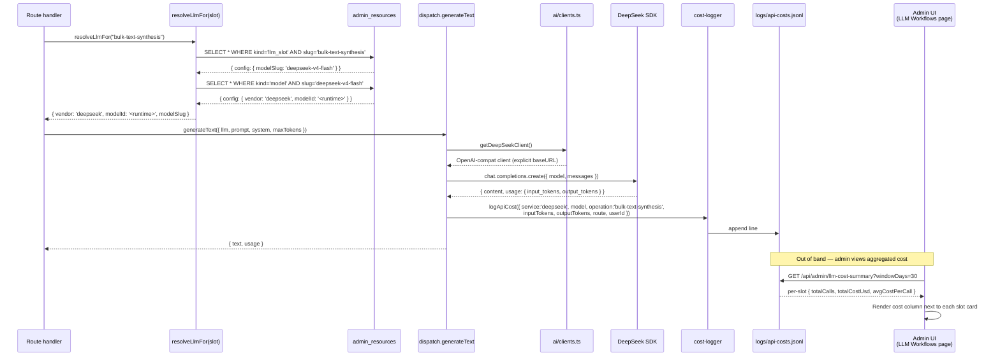

# T3-1 Matteo Model Router

## Problem Frame

H+ Analytics currently routes every outgoing LLM call through a hand-picked model per slot.
Most slots default to Anthropic Sonnet or Opus, including bulk-text and OCR-shaped workloads
where the team's stated intent is to use a 6–20× cheaper model with no measurable quality loss.
The result is monthly token spend that is materially higher than necessary, and every change
to a routing decision requires a code change because the admin panel only assigns models that
are already seeded into `admin_resources` — it cannot reach DeepSeek or Mistral at all, because
those vendors have no SDK client, no provider branch in dispatch, and no model rows in the DB.

Three compounding gaps prevent a "cheapest viable model per task" policy today:

**Gap 1 — Two cost-optimal vendors are absent from the client/dispatch surface.**
`artifacts/api-server/src/ai/clients.ts` instantiates Anthropic, OpenAI, Gemini, Perplexity, and
Exa SDKs as lazy singletons. DeepSeek (bulk text/code, ~10–20× cheaper than Sonnet) and Mistral
(purpose-built OCR/PDF at ~$2/1K pages) are not represented — there is no client factory, no
provider branch in `callLlm`/`callLlmStream` (`routes/chat-llm.ts`) or `generateText`/`streamText`
(`ai/dispatch.ts`), and no `kind='model'` rows in `admin_resources`. Until they exist, no
admin-side dropdown can pick them.

**Gap 2 — Two known violations and one missing slot.**
`artifacts/api-server/src/ai/property-vision.ts` defines `const VISION_MODEL = "claude-opus-4-6"`
as a TypeScript string literal — a direct CLAUDE.md §1 violation. A `vision` llm_slot already
exists in `admin_resources` and should be the resolution path. Separately, `costantino-orchestration`
is referenced in code paths but no migration guard seeds the row, so the resolver throws at runtime
under the Step-0 health-audit cadence. Both gaps must be closed before Matteo "owns" routing.

**Gap 3 — Dispatch path is not cost-logged.**
`artifacts/api-server/src/middleware/cost-logger.ts` writes `logs/api-costs.jsonl` (timestamp,
service, model, operation, tokens, cost USD, durationMs, userId, route) for chat traffic, but
the `dispatch.ts` `generateText`/`streamText` helpers — used by specialist runners, the research
orchestrator's synthesis phase, analyst table refresh, and `regen-constants` — never call
`logApiCost`. The admin "cost per task type" view that Matteo must produce therefore has no
data to read for the most cost-impactful slots in the system.

The product impact of these gaps compounds: the admin LLM Workflows page is mechanically wired,
but it lists 24 slots and only Anthropic/OpenAI/Gemini/Perplexity models — picking a cheaper
provider for a slot is not possible. The team's stated routing matrix
(`docs/solutions/architecture-patterns/agent-autonomy-managed-agents-dreaming-strategy-2026-05-16.md`)
calls for DeepSeek V4-Flash on bulk text/code and Mistral OCR 3 on PDF extraction, neither of
which the platform can express today.

---

## Target Architecture

Matteo is a **Minion** (deterministic helper, no LLM, no judgment) named per CLAUDE.md §10.
He owns no resolution mechanism of his own — instead, he extends the existing chain so it
can express the team's full routing matrix, and he closes the three gaps above.

```
Route handler (e.g., property-risk runner, analyst-table refresh, Rebecca chat, OCR pre-pass)
    │
    ▼
resolveLlmFor(slot)            ─── reads admin_resources kind='llm_slot' row
    │                              follows config.modelSlug → admin_resources kind='model' row
    │                              returns { vendor, modelId, modelSlug }
    ▼                              (throws if row missing — no TS fallback ever)
dispatch.generateText / streamText            ◀── NEW: logApiCost(...) wraps every call
    │
    ▼
provider branch (vendor)
    ├─ anthropic    → getAnthropicClient()      (existing)
    ├─ openai       → getOpenAIClient()         (existing)
    ├─ gemini       → getGeminiClient()         (existing)
    ├─ perplexity   → getPerplexityClient()     (existing)
    ├─ deepseek     → getDeepSeekClient()       (NEW; OpenAI-compat SDK, explicit baseURL)
    └─ mistral      → getMistralClient()        (NEW; OpenAI-compat SDK, explicit baseURL)
                                                (Mistral OCR uses kind='api' row, not model row)
    │
    ▼
LLM provider HTTP
    │
    ▼
response → logApiCost({ service, model, operation, inputTokens, outputTokens, route, userId })
                                                      │
                                                      ▼
                                              logs/api-costs.jsonl
                                                      │
                                                      ▼
                                  GET /api/admin/llm-cost-summary
                                                      │
                                                      ▼
                                  Admin LLM Workflows page — per-slot $/task estimate
                                  (aggregated from JSONL by slot resolution path)
```

**Routing matrix (admin-editable, no deploy):**

| Task class | Slot slug (existing or new) | Target model (admin can change) |
|---|---|---|
| PDF/OCR text extraction | `pdf-ocr-extraction` (NEW) | Mistral OCR 3 (kind='api') |
| Bulk structured extraction | `structured-extraction` (NEW) | gemini-2-5-flash |
| Bulk text/code synthesis | `bulk-text-synthesis` (NEW) | DeepSeek V4 Flash (NEW model) |
| Financial reasoning / synthesis | `research-synthesis` (existing) | claude-sonnet-4-6 |
| Vision / property photos | `vision` (existing, fix violation) | claude-opus-4-6 |
| Image generation | `image-generation` (existing) | gpt-image-1 |
| All other existing slots | existing 24 slugs | unchanged unless admin re-routes |

**Crucially, none of those model slugs or vendor names exist as TypeScript literals.** They are
rows in `admin_resources` seeded by migration guards (per the `no-hardcoded-integration-identifiers`
convention) and resolved at runtime via `resolveLlmFor`. The matrix above is documentation of
seed intent, not a code-level enum.

---

## Mermaid sequence diagram — Matteo routing data flow



---

## Scope Boundaries

**In scope:**
- `artifacts/api-server/src/ai/clients.ts` — add DeepSeek and Mistral lazy singleton client factories
- `artifacts/api-server/src/ai/dispatch.ts` — DeepSeek/Mistral provider branches; wrap with `logApiCost`
- `artifacts/api-server/src/routes/chat-llm.ts` — DeepSeek/Mistral branches in `callLlm` and `callLlmStream` (conditional spread for sampling params per learning §4)
- `artifacts/api-server/src/ai/property-vision.ts` — remove hardcoded `VISION_MODEL`, resolve through `vision` slot
- `artifacts/api-server/src/migrations/admin-resources-*.ts` — new migration guard adding DeepSeek/Mistral model rows, Mistral OCR API row, new slot rows, and `costantino-orchestration` seed
- `artifacts/api-server/src/routes/admin-llm-cost.ts` — new GET endpoint aggregating `logs/api-costs.jsonl` by slot/window
- `artifacts/api-server/src/ai/rebecca/tools/llm-cost-summary.ts` — Rebecca tool (agent-native parity)
- `artifacts/hospitality-business-portal/src/pages/intelligence/llm-workflows/SlotCard.tsx` — cost-per-task badge
- `artifacts/hospitality-business-portal/src/pages/intelligence/llm-workflows/constants.ts` — add `deepseek`/`mistral` to `LLM_VENDORS`; add new slots to `SLOT_GROUPS`
- `artifacts/hospitality-business-portal/src/pages/intelligence/llm-workflows/useSlotAssignments.ts` — surface cost summary from new endpoint
- `artifacts/api-server/build.mjs` — add new SDK packages to `external` array
- `artifacts/api-server/package.json` — add `@mistralai/mistralai` and (if used) DeepSeek SDK / `openai`-compat re-use to `dependencies`
- `artifacts/api-server/src/config/llm-pricing.json` — add DeepSeek and Mistral price rows
- `docs/discipline/agent-native-parity-map.md` — register Rebecca tool for cost summary

**Not in scope (do not touch, per CLAUDE.md §9):**
- `lib/engine/src/**`
- `lib/calc/src/**`
- `artifacts/api-server/src/finance/**`
- `artifacts/api-server/src/report/**`
- `artifacts/api-server/src/tests/proof/**`
- `artifacts/api-server/src/tests/engine/**`
- Any change to slide factory builders or `slide-factory/**` (factory routing remains unchanged in this plan; a follow-on plan can re-route `factory-v2-lorenzo-vision` once Matteo lands)

**Not in scope (deferred to follow-on plans):**
- Replacing the SDK pattern with a gateway/proxy (LiteLLM, Bifrost) — not justified at current scale per "What Matteo is NOT" section of the brief
- Migrating Rebecca itself onto DeepSeek — Rebecca stays on the existing `specialist-primary` slot; admin can re-route post-merge if quality monitoring supports it
- Per-tenant routing overrides (`organization_id` → slot mapping) — single global routing only in this phase
- Auto-failover when a vendor returns 429/5xx — Matteo always returns the admin-assigned model; failover is a separate plan

---

## High-Level Technical Design

### 1. Vendor surface extension is additive, not replacing

The existing client/dispatch pattern (lazy singleton per vendor, single provider switch in
`dispatch.ts` and `chat-llm.ts`) scales fine to 6 vendors. We add two factories and two
provider branches and stop — no gateway, no abstraction layer, no provider registry.

Both DeepSeek and Mistral expose OpenAI-compatible chat completion APIs and have first-party
SDKs that mirror the OpenAI SDK shape. To prevent `OPENAI_BASE_URL` env var bleed (learning §5,
`docs/solutions/integration-issues/openai-sdk-env-base-url-overrides-embedding-client-2026-05-02.md`):

- The DeepSeek client factory constructs its OpenAI-compat client with an **explicit `baseURL`**
  read from a dedicated env var (`DEEPSEEK_API_BASE_URL` if set, else the vendor's published
  default, sourced from the `kind='model'` row's `config.endpoint`).
- Mistral OCR is an HTTP-only API (kind='api'), not a chat model — its client wraps `fetch`
  against the URL stored in the `admin_resources` row's `config.endpoint`. No OpenAI SDK reuse.
- For Mistral chat models (if seeded), use `@mistralai/mistralai` first-party SDK with explicit
  client construction — same env-bleed protection.
- All factories log their resolved `baseURL` once at first-use via `console.info` with a
  unique tag (`[matteo:deepseek:init]`, `[matteo:mistral:init]`) — dev/prod divergence visibility.

### 2. Resolution chain stays unchanged

`resolveLlmFor(slot)` in `artifacts/api-server/src/ai/llm-config-resolver.ts` already returns
`{ vendor, modelId, modelSlug }`. Matteo introduces **no new resolver function**. The vendor
field is whatever string the seeded row contains — adding new vendors `'deepseek'` and `'mistral'`
to admin_resources rows automatically flows through. The closed-union risk (learning §1) is
handled by keeping vendor as a `string` everywhere in dispatch, never narrowing to a TypeScript
literal-union type. The provider switch uses a default case that throws with the actual vendor
string in the error message ("unknown vendor: $vendor — check admin_resources kind='model' row").

### 3. Cost logging becomes uniform across the dispatch path

`logApiCost` lives in `artifacts/api-server/src/middleware/cost-logger.ts` today and is called
from a subset of route files. Matteo moves the call into `dispatch.ts` so every call through
the central dispatcher is logged with the slot's resolved model and the route name. Call sites
that bypass dispatch (e.g., direct `streamObject` from `ai` SDK in specialist runners) are
left alone — a follow-up unit (U8) wraps the most active of those, but specialist runners are
not all migrated in this plan to keep scope tight.

The pricing config (`artifacts/api-server/src/config/llm-pricing.json`) is extended with
DeepSeek and Mistral rows. Per the no-hardcoded-identifiers convention, the JSON file is a
**configuration artifact** (not TypeScript), and its model-slug keys mirror the seeded
`admin_resources` model slugs — they are the same identifier expressed in two artifacts,
which is acceptable. The cost-logger reads keys by exact match; an unknown slug logs the
call with `estimatedCostUsd: null` (so the admin sees "no price configured" rather than a
silent zero).

### 4. Admin cost view reads JSONL, not a separate counter

Rather than adding a `model_usage_log` Postgres table, the admin cost endpoint
(`GET /api/admin/llm-cost-summary`) tail-reads `logs/api-costs.jsonl`, filters by the
request window (default 30 days), and aggregates by `service+model+operation`. The endpoint
returns per-slot rollups by reverse-resolving the model → slot via the same
`admin_resources` chain Matteo uses for routing. JSONL is append-only and rotated by the
existing log infrastructure; no new DB schema.

For very large windows we cap result rows at 10k and stream the file with `readline`. For
the slot-resolution direction (model_slug → which slot(s) point at it), we read all
`kind='llm_slot'` rows once per request and build the inverse map in memory — cheap, no
schema change.

### 5. Rebecca tool — agent-native parity

A new tool `download_llm_cost_summary` (per `agent-native-parity-map.md`) exposes the same
endpoint to Rebecca, returning `{ slotSlug, modelSlug, totalCalls, totalCostUsd, avgCostPerCall, windowDays }`
rows. Per CLAUDE.md §7 a UI capability must always carry a Rebecca counterpart in the same PR.

### 6. The `property-vision.ts` violation fix is bundled

This file currently does:
```ts
// VIOLATION (CLAUDE.md §1)
const VISION_MODEL = "claude-opus-4-6";
```
Fix: import `resolveLlmFor`, call `resolveLlmFor('vision')`, pass the returned `{ vendor, modelId }`
through dispatch. The existing `vision` slot's config already points at `claude-opus-4-6`, so
behavior is unchanged; the violation is the wiring, not the chosen model. This fix is bundled
into Matteo because the team's stated intent is "Matteo owns routing", and leaving a hardcoded
model in a vision call site means the LLMs page can re-route every slot except one.

### 7. Build externals and package.json

New SDK packages live in `dependencies` (not `devDependencies`) so Railway's runtime
`pnpm install` picks them up. Both are added to the `external` array in
`artifacts/api-server/build.mjs` alongside `@anthropic-ai/sdk`, `@google/genai`, `openai`, etc.,
to keep the api-server bundle near its current ~7.5MB.

---

## Implementation Units

Eight dependency-ordered units. Each unit completes the §5 verification gate
(typecheck + magic-numbers + relevant tests) before the next begins.

### U1 — Seed DeepSeek + Mistral models, new slots, fix Costantino slot gap

**Files (write):**
- `artifacts/api-server/src/migrations/admin-resources-006-matteo-router.ts` (NEW migration guard)

**What:**
- Add `kind='model'` rows for: `deepseek-v4-flash`, `deepseek-v4`, `mistral-large-latest`, `mistral-small-latest`. `config` carries `{ vendor: 'deepseek' | 'mistral', modelId: <vendor-published-id>, endpoint: <baseURL> }`.
- Add `kind='api'` row for `mistral-ocr-3` with `config.endpoint` and `config.healthProbe` (per Costantino).
- Add `kind='llm_slot'` rows for new task types: `pdf-ocr-extraction`, `structured-extraction`, `bulk-text-synthesis`. Each row's `config.modelSlug` points at the corresponding model slug seeded above.
- Seed the missing `costantino-orchestration` llm_slot row (existing code references it; resolver throws today).
- Use `INSERT … ON CONFLICT (slug) DO NOTHING` — idempotent.
- Add source citations in row `notes` field for pricing (DeepSeek + Mistral pricing pages).
- **Pre-flight gate (mandatory):** run the live-DB query from learning §3 before merging:
  `SELECT id FROM admin_resources WHERE research_config::text LIKE '%deepseek%' OR research_config::text LIKE '%mistral%'`. If any rows return, audit them before this migration's seed runs (no slug collision).
- Add `DEPRECATED_MODEL_MAP` entry hooks (currently empty) in `clients.ts` for future deprecation safety.

**Verify:**
- Boot the api-server locally; observe migration guard logs "admin-resources-006-matteo-router applied".
- `SELECT slug FROM admin_resources WHERE kind='llm_slot' AND slug IN ('pdf-ocr-extraction','structured-extraction','bulk-text-synthesis','costantino-orchestration')` returns 4 rows.
- `SELECT slug FROM admin_resources WHERE kind='model' AND slug LIKE 'deepseek-%' OR slug LIKE 'mistral-%'` returns ≥4 rows.
- `resolveLlmFor('costantino-orchestration')` no longer throws.

**Test scenarios:**
- T1.1: Migration guard runs to completion on an empty DB without error.
- T1.2: Migration guard is idempotent — running twice produces the same row set.
- T1.3: Each new slot row's `config.modelSlug` resolves to an existing model row (no dangling references).
- T1.4: `resolveLlmFor('pdf-ocr-extraction')` returns `{ vendor: 'mistral', modelSlug: 'mistral-ocr-3' }` (or the seeded equivalent).
- T1.5: Pre-existing slot resolutions are unchanged (smoke: `vision`, `executive-summary-property`, `research-synthesis`).

**Verification gate:**
- [ ] `pnpm run typecheck`
- [ ] `scripts/node_modules/.bin/tsx scripts/src/check-magic-numbers.ts` PASS (migration file is in the seed-file exemption per CLAUDE.md §2 exception for `artifacts/api-server/src/migrations/*.ts` SEED constants)
- [ ] `pnpm --filter @workspace/scripts run check:migration-guards` PASS

**Dependencies:** none. Foundation for U2–U8.

---

### U2 — DeepSeek + Mistral SDK client factories in `ai/clients.ts`

**Files (edit):**
- `artifacts/api-server/src/ai/clients.ts`
- `artifacts/api-server/package.json` — add `@mistralai/mistralai` to `dependencies`; reuse `openai` package for DeepSeek (OpenAI-compat) — no new dep needed for DeepSeek
- `artifacts/api-server/build.mjs` — add `@mistralai/mistralai` to `external` array (`openai` is already external)

**What:**
- Add `getDeepSeekClient()`: lazy singleton; constructs an OpenAI SDK client with explicit `baseURL` resolved from the `deepseek-v4-flash` model row's `config.endpoint` (read once via async DB fetch on first use), and explicit `apiKey: process.env.DEEPSEEK_API_KEY`. Throws if env var unset. Logs `[matteo:deepseek:init]` with resolved baseURL on first init.
- Add `getMistralClient()`: lazy singleton; uses `@mistralai/mistralai` SDK with explicit client construction. `apiKey: process.env.MISTRAL_API_KEY`. Throws if env var unset. Logs `[matteo:mistral:init]`.
- Add `getMistralOcrClient()`: a thin `fetch` wrapper that reads endpoint from `kind='api'` row `mistral-ocr-3` (Mistral OCR is HTTP-only). Reads `MISTRAL_API_KEY`.
- Extend `normalizeModelId()` only if vendor-side renames occur — none expected at seed time.
- No new types exported. Vendor stays `string`-typed at the dispatch boundary (learning §1).
- Add `DEEPSEEK_API_KEY` and `MISTRAL_API_KEY` to the env-var section of `CLAUDE.md` (memory-file harmonize pass with `replit.md` per the mandatory shipping gate).

**Verify:**
- Local boot with `DEEPSEEK_API_KEY` set: invoking `getDeepSeekClient()` once logs `[matteo:deepseek:init] baseURL=<from-DB>` exactly once across many subsequent calls (singleton).
- Local boot with `DEEPSEEK_API_KEY` unset: first call throws a clear `"DEEPSEEK_API_KEY not set"` error.

**Test scenarios:**
- T2.1: First call to `getDeepSeekClient()` resolves baseURL from `admin_resources.config.endpoint` (mock the resolver in tests).
- T2.2: Subsequent calls return the same instance (singleton).
- T2.3: Missing API key → explicit thrown error mentioning which env var.
- T2.4: `OPENAI_BASE_URL` env var bleed test: with `OPENAI_BASE_URL=http://wrong-host`, `getDeepSeekClient()` still constructs with the DB-resolved baseURL, not the env var (learning §5).
- T2.5: `getMistralOcrClient()` calls hit the URL from the `mistral-ocr-3` API row's `config.endpoint`.
- T2.6: Build externals: `pnpm --filter @workspace/api-server run build` succeeds and bundle size is within +500KB of pre-Matteo baseline.

**Verification gate:**
- [ ] `pnpm run typecheck`
- [ ] `scripts/node_modules/.bin/tsx scripts/src/check-magic-numbers.ts` PASS
- [ ] api-server unit tests for clients (mocked DB) PASS

**Dependencies:** U1 (model rows must exist for endpoint resolution).

---

### U3 — Dispatch provider branches + uniform `logApiCost` wrap

**Files (edit):**
- `artifacts/api-server/src/ai/dispatch.ts`
- `artifacts/api-server/src/middleware/cost-logger.ts` (no behavior change, just confirm import surface)

**What:**
- In `generateText({ llm, prompt, system, maxTokens })` and `streamText`, add `case 'deepseek'` and `case 'mistral'` branches. Both use OpenAI-compat chat completions shape. The Mistral chat branch uses `@mistralai/mistralai`'s SDK shape, not OpenAI's, since it's a first-party SDK.
- Default case throws `"unknown vendor: <vendor> — check admin_resources kind='model' row for modelSlug=<modelSlug>"` (string interpolation, no closed union).
- Wrap every successful response with `logApiCost({ service: vendor, model: modelId, operation: <slot-derived>, inputTokens, outputTokens, durationMs, route, userId })`. Slot is passed in through a new optional `operation` field on the dispatch input (callers already know their slot).
- Pricing config: add DeepSeek and Mistral rows to `artifacts/api-server/src/config/llm-pricing.json` with `inputCostPerMillionTokens` / `outputCostPerMillionTokens` from the seeded model rows' `config.notes`. Cost-logger falls back to `null` cost for unknown slugs (no silent zero).
- All sampling params (`temperature`, `top_p`, `max_tokens`) use conditional spread per learning §4. Pattern: `...(sampling.topP !== undefined ? { top_p: sampling.topP } : {})`.

**Verify:**
- Trace a `generateText({ llm: { vendor: 'deepseek', modelId: '...' }, ... })` call and confirm one `logs/api-costs.jsonl` line written with `service: 'deepseek'` and non-null `estimatedCostUsd`.

**Test scenarios:**
- T3.1: `generateText` with `vendor: 'deepseek'` returns text and writes one JSONL line.
- T3.2: `generateText` with `vendor: 'mistral'` returns text and writes one JSONL line.
- T3.3: `generateText` with `vendor: 'unknownvendor'` throws an error mentioning the vendor and modelSlug.
- T3.4: `streamText` with `vendor: 'deepseek'` streams chunks and writes one JSONL line on completion.
- T3.5: `streamText` interrupted mid-stream (client disconnect) still writes a partial-usage JSONL line (durationMs present, output tokens reflect what was emitted).
- T3.6: A call with an unknown model slug in pricing config writes the line with `estimatedCostUsd: null` and does NOT crash.
- T3.7: Sampling param conflict regression: passing `{ temperature: 0.2, topP: 0.95 }` to Anthropic, OpenAI, DeepSeek, and Mistral branches must succeed for all (or fail with a clear provider error for any that forbid the combination — caught by test, not silently dropped).
- T3.8: All five existing vendors (anthropic, openai, gemini, perplexity, exa) still pass their existing dispatch tests — regression.

**Verification gate:**
- [ ] `pnpm run typecheck`
- [ ] `scripts/node_modules/.bin/tsx scripts/src/check-magic-numbers.ts` PASS
- [ ] `pnpm --filter @workspace/api-server test -- dispatch` PASS

**Dependencies:** U2.

---

### U4 — `chat-llm.ts` (Rebecca + agent chat) provider branches

**Files (edit):**
- `artifacts/api-server/src/routes/chat-llm.ts`

**What:**
- In `callLlm(provider, model, systemPrompt, history, userMessage, sampling, ...)`, add `case 'deepseek'` and `case 'mistral'` branches. Both wire through the same SDK clients from U2.
- In `callLlmStream(...)`, add the same two branches with streaming.
- Use conditional spread for `temperature`, `top_p`, `max_tokens` per learning §4. The pattern was the root cause of the Iris LLM bug — every new provider must follow it. Add an inline comment pointing at `docs/solutions/integration-issues/iris-llm-temperature-top-p-conflict-2026-05-08.md`.
- Wire `logApiCost` at the end of each branch with `operation: <slot>` — Rebecca's caller passes `'specialist-primary'` (or whichever slot is in play), agents pass their own slot.

**Verify:**
- Rebecca chat session targeting a DeepSeek-routed slot returns a response and writes a `service: 'deepseek'` JSONL line.

**Test scenarios:**
- T4.1: `callLlm('deepseek', ...)` returns assistant text.
- T4.2: `callLlmStream('mistral', ...)` streams chunks.
- T4.3: Sampling regression — `{ topP: 0.95, temperature: 0.2 }` does not produce a 400 from any of the 6 vendors (or fails with a vendor-specific clear error message).
- T4.4: Re-test full Rebecca conversation against `specialist-primary` slot (default Anthropic) — unchanged.
- T4.5: Re-test Iris health-check against `iris-health-check` slot — unchanged.

**Verification gate:**
- [ ] `pnpm run typecheck`
- [ ] `scripts/node_modules/.bin/tsx scripts/src/check-magic-numbers.ts` PASS
- [ ] `pnpm --filter @workspace/api-server test -- chat-llm` PASS

**Dependencies:** U2.

---

### U5 — Fix `property-vision.ts` hardcoded model + remove `VISION_MODEL` constant

**Files (edit):**
- `artifacts/api-server/src/ai/property-vision.ts`

**What:**
- Delete `const VISION_MODEL = "claude-opus-4-6"`.
- Import `resolveLlmFor` from `llm-config-resolver.ts`.
- At the head of the vision function: `const { vendor, modelId } = await resolveLlmFor('vision')`.
- Pass the resolved `{ vendor, modelId }` through `generateText` (now cost-logged via U3).
- This fixes the CLAUDE.md §1 violation flagged in the research findings. Behavior unchanged because the `vision` slot already points at `claude-opus-4-6`.

**Verify:**
- A property vision call still succeeds end-to-end.
- Re-route the `vision` slot via the admin UI to `claude-sonnet-4-6` and confirm subsequent vision calls use Sonnet (proves admin re-routability works for vision after the fix).

**Test scenarios:**
- T5.1: Vision call resolves through `resolveLlmFor('vision')` (mock the resolver to assert it's called).
- T5.2: Vision call writes a `service: 'anthropic'` JSONL line with `operation: 'vision'`.
- T5.3: Re-routing the `vision` slot's `config.modelSlug` in admin_resources changes the next vision call's `service` field accordingly (proves no caching beyond the singleton clients).
- T5.4: Magic-numbers gate fails before this unit and passes after (regression-prevention proof).

**Verification gate:**
- [ ] `pnpm run typecheck`
- [ ] `scripts/node_modules/.bin/tsx scripts/src/check-magic-numbers.ts` PASS (the constant is gone)
- [ ] Vision smoke test PASS

**Dependencies:** U2, U3.

---

### U6 — Admin LLM cost summary endpoint + Rebecca tool

**Files (write):**
- `artifacts/api-server/src/routes/admin-llm-cost.ts` (NEW)
- `artifacts/api-server/src/ai/rebecca/tools/llm-cost-summary.ts` (NEW)

**Files (edit):**
- `artifacts/api-server/src/routes/index.ts` (or wherever route registration happens) — mount the new route
- `artifacts/api-server/src/ai/rebecca/tools/index.ts` — register the new tool
- `docs/discipline/agent-native-parity-map.md` — add the new tool with status ✅

**What:**
- `GET /api/admin/llm-cost-summary?windowDays=30` — admin-only (existing admin middleware). Returns:
  ```json
  {
    "windowDays": 30,
    "windowStart": "...",
    "totalCostUsd": 412.18,
    "perSlot": [
      { "slotSlug": "specialist-primary", "modelSlug": "claude-sonnet-4-6",
        "vendor": "anthropic", "calls": 8412, "totalCostUsd": 218.40,
        "avgCostPerCall": 0.026, "p95DurationMs": 4100 },
      ...
    ]
  }
  ```
- Implementation:
  1. Read `logs/api-costs.jsonl` via `readline`, filter by `windowStart`.
  2. Read all `kind='llm_slot'` and `kind='model'` rows once; build `modelSlug → slotSlug[]` inverse map.
  3. Aggregate by `service+model`, then attribute to slot via inverse map.
  4. If a model serves multiple slots, split rows by `operation` field (which carries the slot slug — set in U3).
  5. Stream-process the JSONL; cap output at 10k rows.
- Rebecca tool `download_llm_cost_summary` is a thin wrapper over the same endpoint, returning the JSON inline. Per §7, this is the agent-native parity counterpart.

**Verify:**
- `curl /api/admin/llm-cost-summary?windowDays=7` (with admin cookie) returns a populated JSON.
- In a Rebecca chat: "What did we spend on LLMs this week?" triggers `download_llm_cost_summary` and quotes the totals.

**Test scenarios:**
- T6.1: Empty JSONL → endpoint returns `{ totalCostUsd: 0, perSlot: [] }` with HTTP 200.
- T6.2: 100 lines across 3 slots → endpoint returns 3 slot entries with correct sums.
- T6.3: Unknown-model line (no pricing) → contributes to `calls` but not `totalCostUsd` (null-coalesce).
- T6.4: Non-admin user → HTTP 403.
- T6.5: `windowDays=0` → 400 with clear error.
- T6.6: Rebecca tool invocation returns the same payload as the HTTP call.
- T6.7: A model serving multiple slots (e.g., `claude-sonnet-4-6` used by both `executive-summary-property` and `executive-summary-portfolio`) is split correctly by `operation` field.

**Verification gate:**
- [ ] `pnpm run typecheck`
- [ ] `scripts/node_modules/.bin/tsx scripts/src/check-magic-numbers.ts` PASS
- [ ] `pnpm --filter @workspace/api-server test -- admin-llm-cost` PASS
- [ ] Parity map updated

**Dependencies:** U3 (needs JSONL to be populated by dispatch).

---

### U7 — Admin LLM Workflows page: cost badge + new vendors + new slots

**Files (edit):**
- `artifacts/hospitality-business-portal/src/pages/intelligence/llm-workflows/constants.ts`
- `artifacts/hospitality-business-portal/src/pages/intelligence/llm-workflows/useSlotAssignments.ts`
- `artifacts/hospitality-business-portal/src/pages/intelligence/llm-workflows/SlotCard.tsx`
- `artifacts/hospitality-business-portal/src/pages/intelligence/llm-workflows/sections/SlotAccordion.tsx` (if slot grouping needs adjustment for new slots)

**What:**
- `constants.ts`:
  - Add `'deepseek'` and `'mistral'` to the `LLM_VENDORS` array.
  - Add new slot group entries in `SLOT_GROUPS` for `pdf-ocr-extraction`, `structured-extraction`, `bulk-text-synthesis` (likely a new "Data Extraction" or extended "Research" group — match the design from `docs/solutions/architecture-patterns/llms-page-slot-accordion-design-2026-05-09.md`).
- `useSlotAssignments.ts`:
  - Add a parallel `useQuery` for `GET /api/admin/llm-cost-summary?windowDays=30` (or admin-configurable window).
  - Build a `slotSlug → costSummary` map and return alongside the existing assignment state.
- `SlotCard.tsx`:
  - Render a small "30d cost" badge under the model dropdown showing `$X / month estimated` from the cost summary map. If no data, show "—".
  - Tooltip shows `calls` and `avgCostPerCall`.
- All copy lives in component constants (no business-data literals).

**Verify:**
- Admin sees DeepSeek and Mistral options in the vendor filter on every slot card.
- A 30d cost badge appears under every slot card that has logged usage.
- Admin can re-route the `bulk-text-synthesis` slot from DeepSeek to Sonnet (or vice versa) and the badge updates after the next call.

**Test scenarios:**
- T7.1: Vendor filter shows 6 vendors including DeepSeek and Mistral.
- T7.2: SlotCard renders cost badge when cost-summary data is present.
- T7.3: SlotCard renders "—" badge when no cost data for that slot.
- T7.4: Re-routing a slot via the dropdown triggers a PUT to `/api/admin/resources/:id`, the same path used today.
- T7.5: New slots `pdf-ocr-extraction`, `structured-extraction`, `bulk-text-synthesis` appear in the appropriate accordion group.
- T7.6: Existing 24 slots still render and existing assignments are preserved (regression).

**Verification gate:**
- [ ] `pnpm run typecheck`
- [ ] `scripts/node_modules/.bin/tsx scripts/src/check-magic-numbers.ts` PASS
- [ ] `pnpm --filter @workspace/hospitality-business-portal test -- llm-workflows` PASS
- [ ] `/post-coding-design-review` PASS (per CLAUDE.md §11)

**Dependencies:** U1, U6.

---

### U8 — Route the new slots into actual call sites (proof of usability)

**Files (edit, narrow):**
- `artifacts/api-server/src/ai/property-docs/pdf-extract.ts` (or the canonical PDF extraction site — confirm path during implementation) → route through `pdf-ocr-extraction` slot
- `artifacts/api-server/src/ai/specialists/mgmt-co-*-runner.ts` (one runner) → route the most token-heavy synthesis call through `bulk-text-synthesis` slot, with a feature flag to roll back
- `artifacts/api-server/src/ai/research-orchestrator.ts` (synthesis phase) → route through `structured-extraction` slot if synthesis schema is structured

**Out of scope here (explicitly):**
- `artifacts/api-server/src/finance/**`, `artifacts/api-server/src/report/**` — CLAUDE.md §9 protected surface
- Migrating all 6 mgmt-co runners — pick the most cost-heavy one for the proof; the rest is a follow-on plan

**What:**
- For each routed call site, replace its current `resolveLlmFor('<old-slot>')` with the new slot **OR** add a feature flag `ROUTING_<SLOT>_NEW = process.env.MATTEO_ENABLE_<slot> === 'true'`. Default off; flip on after a 7-day cost monitoring window.
- The feature flag is a Category-3 admin variable in `admin_resources` `kind='parameter'`, not a TS literal — admin can toggle without a deploy. The env-var fallback is dev-only.
- Each routed site must have its previous-vs-new slot pairing recorded in `docs/discipline/agent-native-parity-map.md` for audit.

**Verify:**
- With flag off: behavior unchanged from pre-Matteo (regression-safe).
- With flag on for one site: JSONL shows `service: 'deepseek'` for `bulk-text-synthesis` calls, and the output quality is monitored manually for a week.

**Test scenarios:**
- T8.1: Flag off — call site uses old slot and old vendor.
- T8.2: Flag on — call site uses new slot, new vendor, new model.
- T8.3: Output structure validation (Zod schema) for the routed call passes on both old and new model.
- T8.4: Cost JSONL line lands for both flag states (just under a different `operation`).
- T8.5: Rollback drill: flip flag off mid-traffic, next call uses old vendor without restart.

**Verification gate:**
- [ ] `pnpm run typecheck`
- [ ] `scripts/node_modules/.bin/tsx scripts/src/check-magic-numbers.ts` PASS
- [ ] Existing specialist runner tests PASS (regression)
- [ ] Manual quality gate: human review of 10 outputs from new vendor before flipping production flag

**Dependencies:** U1–U7.

---

## Phased Delivery

### Phase 1 — Provider wiring + gap fixes (U1–U5, U6)

**Goal:** the LLM Workflows page can express the full routing matrix; no behavior change yet.

- U1 — seed DeepSeek/Mistral models, new slots, fix Costantino gap
- U2 — DeepSeek/Mistral SDK client factories
- U3 — dispatch.ts provider branches + uniform `logApiCost`
- U4 — chat-llm.ts provider branches
- U5 — fix property-vision.ts hardcoded `VISION_MODEL`
- U6 — admin cost summary endpoint + Rebecca tool

**Exit criteria:**
- All 26+ slots (24 existing + 3 new + costantino-orchestration) resolve without throwing
- DeepSeek and Mistral models reachable through `dispatch.ts` and `chat-llm.ts`
- `logs/api-costs.jsonl` has lines from every dispatch-path call
- `GET /api/admin/llm-cost-summary` returns aggregated data
- No production behavior change yet — Matteo is wired but no traffic is re-routed

### Phase 2 — Admin visibility + first re-routing (U7, U8)

**Goal:** admin can see cost-per-task and re-route slots without a deploy; one or two slots actually moved to cheaper vendors with manual quality monitoring.

- U7 — admin LLM Workflows page extensions (vendors, cost badges, new slot groups)
- U8 — route 2–3 specific call sites through new cheaper slots behind feature flags

**Exit criteria:**
- Admin can pick DeepSeek for any slot from the dropdown
- 30-day cost summary visible on every slot card
- At least one slot (likely PDF OCR) moved to Mistral OCR in production with quality monitoring
- At least one bulk-text synthesis call moved to DeepSeek V4 Flash with quality monitoring
- Cost JSONL shows the routing change in `service` field

### Phase 3 (out of scope for this plan — separate follow-on)

- Migrate remaining specialist runners (5 mgmt-co-*-runners, portfolio-raise-runner, property-risk-intelligence-runner) onto cheaper slots if quality data supports it
- Migrate Vercel AI SDK `streamObject`/`generateObject` call sites onto the new dispatch path so they get cost-logged
- Per-tenant routing overrides
- Auto-failover on vendor 429/5xx

---

## Risks

| # | Risk | Likelihood | Severity | Mitigation |
|---|---|---|---|---|
| R1 | DeepSeek or Mistral output quality drops below the prior model for a routed slot, silently degrading deck/research quality | Medium | High | Feature flag every routing change in U8; manual 10-output review gate; cost summary's `p95DurationMs` field acts as a freshness/latency canary |
| R2 | `OPENAI_BASE_URL` env var bleed silently sends DeepSeek traffic to OpenAI (learning §5) | Medium | High | Explicit `baseURL` in U2 client factories; init-time log of resolved baseURL; T2.4 test enforces this regression |
| R3 | Closed-union vendor type leaks back in via Zod schema or TS literal in dispatch (learning §1) | Medium | Medium | Code review checklist item; vendor stays `string`-typed at dispatch boundary; default `case` throws with the runtime vendor string |
| R4 | Adding `logApiCost` to dispatch slows hot path | Low | Medium | `logApiCost` is async fire-and-forget today; verify no `await` introduced in dispatch return; load-test U3 |
| R5 | JSONL grows unbounded; cost endpoint slows | Medium | Low | Cap result rows at 10k; document rotation expectation in `docs/runbooks/cost-jsonl-rotation.md` (separate doc PR); add `windowDays` mandatory in endpoint |
| R6 | Sampling-param conflict for DeepSeek or Mistral (learning §4) | Medium | Medium | T3.7 and T4.3 test scenarios cover all 6 vendors; conditional spread pattern required and called out inline |
| R7 | `costantino-orchestration` slot seed clashes with existing live-DB row | Low | Medium | Pre-flight DB query in U1; idempotent `INSERT ... ON CONFLICT DO NOTHING` |
| R8 | Replit secrets parity: `DEEPSEEK_API_KEY` / `MISTRAL_API_KEY` added to Railway but missed in Replit secrets, silently breaks dev preview (CLAUDE.md inviolable rule #1) | High | Medium | Dual-env checklist in PR description; `CLAUDE.md` env-var table updated; harmonize with `replit.md` |
| R9 | Slide factory or financial engine accidentally re-routed during U8 | Low | Critical | U8 file scope explicitly excludes §9 surface; PR description must call out file scope before merge; CC-only authoring per §9 |
| R10 | Existing 24 slots get re-routed to an untested vendor by accident during U1 seed | Low | High | U1 only adds rows; uses `INSERT ... ON CONFLICT DO NOTHING`; existing slot rows are not updated |
| R11 | Mistral OCR endpoint shape differs from chat completion shape (multipart upload, async job) | Medium | Medium | `getMistralOcrClient()` is a dedicated `fetch` wrapper, not OpenAI-SDK-shaped; U2 explicitly separates OCR from chat clients |
| R12 | Admin re-routes a slot mid-request, cached singleton client serves wrong model | Low | Low | Singleton is the SDK client (per vendor), not the per-slot resolution; `resolveLlmFor` is called fresh on every dispatch call so re-routing applies immediately |

---

## System-Wide Impact

**LLM call sites touched directly:**
- `ai/clients.ts` — adds 2 new singleton factories (no existing client behavior change)
- `ai/dispatch.ts` — adds 2 new branches + uniform `logApiCost` wrap (every existing dispatch user gets cost-logged for free)
- `routes/chat-llm.ts` — adds 2 new branches (Rebecca's existing path unchanged in behavior)
- `ai/property-vision.ts` — replaces hardcoded model with slot resolution
- 2–3 call sites in U8 — feature-flagged re-routing

**LLM call sites NOT touched but indirectly affected (because they go through dispatch):**
- All 6 `ai/specialists/mgmt-co-*-runner.ts` files via `ai` SDK (use Vercel AI SDK directly; NOT logged by dispatch — Phase 3 work)
- `ai/research-orchestrator.ts` synthesis phase (same)
- `ai/portfolio-raise-runner.ts` (same)
- `ai/property-risk-intelligence-runner.ts` (same)

These remain unlogged for now; Phase 3 plan will migrate them. The cost summary in Phase 1
covers the dispatch path and the chat-llm path — material coverage of the cost surface but
not 100%. The summary endpoint should label this explicitly in its response shape (`coverage: 'dispatch+chat'`).

**Database impact:**
- ~10 new rows in `admin_resources`:
  - 4 model rows (`deepseek-v4-flash`, `deepseek-v4`, `mistral-large-latest`, `mistral-small-latest`)
  - 1 API row (`mistral-ocr-3`)
  - 4 new llm_slot rows (`pdf-ocr-extraction`, `structured-extraction`, `bulk-text-synthesis`, `costantino-orchestration`)
  - 0 new tables
- No schema migrations (data-only migration guard)

**Frontend impact:**
- LLM Workflows page extended; no other pages touched
- New vendor names in vendor filter; new slot groups in accordion; cost badge component

**Build / deploy impact:**
- `+1` runtime dependency (`@mistralai/mistralai`); DeepSeek reuses existing `openai` package
- Bundle size delta expected < 500KB (both SDKs are externalized; only pulled in at runtime by `pnpm install`)
- 2 new required env vars: `DEEPSEEK_API_KEY`, `MISTRAL_API_KEY` — must be added to **both** Railway and Replit secrets (CLAUDE.md inviolable rule #1)
- 1 optional env var: `DEEPSEEK_API_BASE_URL` (overrides DB endpoint for dev/proxy)

**Cost / observability impact:**
- `logs/api-costs.jsonl` line volume increases by the dispatch-path call count (estimated 5–10×) — verify rotation policy
- 30-day cost summary becomes the canonical dashboard for AI spend (replacing manual JSONL parsing)
- Once routing is shifted (Phase 2 U8), monthly AI spend target reduction: 30–50% (project goal)

**Skills / docs to update:**
- `.agents/skills/slide-factory/SKILL.md` roster — register Matteo as a Minion
- `docs/discipline/agent-native-parity-map.md` — add `download_llm_cost_summary` Rebecca tool
- `CLAUDE.md` and `replit.md` env-var tables — `DEEPSEEK_API_KEY`, `MISTRAL_API_KEY` (mandatory harmonize pass)
- `docs/runbooks/cost-jsonl-rotation.md` — new short runbook explaining rotation expectations (separate small PR)

**Agent-native parity (CLAUDE.md §7):**
- New admin UI capability: view cost-per-slot. New Rebecca tool `download_llm_cost_summary` ships in same PR.
- New admin UI capability: re-route any slot to DeepSeek/Mistral — already covered by existing `resource_update` Rebecca tool (no new tool needed; vendor list is data, not code).
- Parity map updated to ✅ for the new tool.

**Financial engine isolation (CLAUDE.md §9):**
- Zero touch to `lib/engine/src/`, `lib/calc/src/`, `artifacts/api-server/src/finance/`, `artifacts/api-server/src/report/`
- The financial engine continues to use whatever model the admin assigns to its slots; routing changes there are explicitly out of scope for this plan

**Number taxonomy (CLAUDE.md §1, §2):**
- All model slugs, vendor names, endpoint URLs live in `admin_resources` rows — never TS literals
- Pricing config (`llm-pricing.json`) is a configuration artifact with the same model-slug keys, acceptable per learning §1
- Magic-numbers gate passes for all touched files; structural clamps and `30` (default windowDays in cost endpoint) need to be named constants per the rule

---

## Verification Gate (cumulative across all units)

- [ ] `pnpm run typecheck` — clean
- [ ] `scripts/node_modules/.bin/tsx scripts/src/check-magic-numbers.ts` — PASS
- [ ] `pnpm --filter @workspace/scripts run check:migration-guards` — PASS
- [ ] `pnpm --filter @workspace/api-server test` — PASS
- [ ] `pnpm --filter @workspace/hospitality-business-portal test` — PASS
- [ ] `/post-coding-design-review` — PASS (per CLAUDE.md §11) for U7
- [ ] Manual: Rebecca tool invocation returns cost summary
- [ ] Manual: admin UI shows DeepSeek + Mistral in vendor filter; cost badge renders
- [ ] Manual: a routed call (flag on) writes `service: 'deepseek'` to JSONL
- [ ] Memory-file harmonize pass: `CLAUDE.md` and `replit.md` env-var tables match
- [ ] Parity map updated for the new Rebecca tool

---

## Open Questions (resolve before / during U1)

1. Mistral OCR billing model is per-page, not per-token — does the cost-logger schema need a `pagesProcessed` field, or do we estimate by stuffing pages into `inputTokens`? Recommended: add nullable `units` and `unitType` fields to the JSONL schema so OCR rows are honest. Decide in U1.
2. DeepSeek's published model IDs may evolve (V4 → V4.1 etc.). Are vendor-published IDs stable enough to put into `config.modelId`, or do we need to use the vendor's "latest" alias? Verify at U1 seeding time using Context7 docs lookup.
3. Mistral chat models (Large, Small) are seeded for completeness, but the team's intent is OCR-only. Should we omit Mistral chat from Phase 1 to reduce surface area? Recommendation: seed but do not surface in the admin dropdown until Phase 3. Decide in U1.
4. Cost summary window: is 30 days the right default for the admin badge, or should it be a 7-day rolling window (faster signal)? Recommendation: 30d default with admin-configurable selector in U7.
